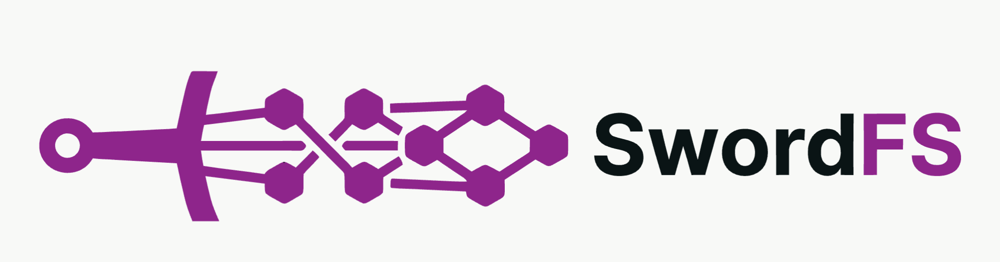

# SwordFS

## What is SwordFS?
SwordFS is a modern, high-performance distributed file system. It is POSIX compliant and designed for the modern workloads of AI/ML applications. The aim of SwordFS is to be the de facto standard for distributed file systems in the AI/ML era.

The major differences between SwordFS and other distributed file systems are as follows:
- High Performance: Performance is the top priority in SwordFS's architecture and feature design. That's why SwordFS is built with C++20, a battle-tested system programming language.
- Client-heavy: SwordFS is designed with heavy logic on the client side, so that the server-side I/O path is minimal. This is a direct result of the performance-first philosophy.
- AI/ML-friendly: SwordFS integrates with GPUs and DPUs natively and seamlessly. It is purpose-built for AI/ML workloads.

## Acknowledgements
- [Folly](https://github.com/facebook/folly): A library of C++20 components designed with practicality and efficiency in mind, from Facebook.
- [JuiceFS](https://github.com/juicedata/juicefs): A high-performance POSIX file system designed for cloud-native environments. SwordFS draws significant inspiration from JuiceFS.