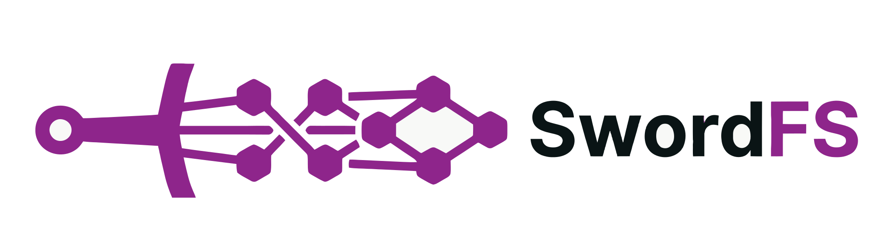

<p align="center"><a href="https://github.com/SwordInfra/SwordFS"></a></p>

# SwordFS

[](https://github.com/SwordInfra/SwordFS/actions/workflows/ci.yml)
[](https://codecov.io/gh/SwordInfra/SwordFS)

## What is SwordFS?
SwordFS is a modern, high-performance distributed file system. It is POSIX compliant and designed for the modern workloads of AI/ML applications. The aim of SwordFS is to be the de facto standard for distributed file systems in the AI/ML era.

The major differences between SwordFS and other distributed file systems are as follows:
- High Performance: Performance is the top priority in SwordFS's architecture and feature design. That's why SwordFS is built with C++20, a battle-tested system programming language.
- Client-heavy: SwordFS is designed with heavy logic on the client side, so that the server-side I/O path is minimal. This is a direct result of the performance-first philosophy.
- AI/ML-friendly: SwordFS integrates with GPUs and DPUs natively and seamlessly. It is purpose-built for AI/ML workloads.

## Architecture
SwordFS is a client-heavy file system where both metadata semantics and data plane operations are primarily handled on the client side, with the server mainly responsible for metadata and data distribution. Similar to JuiceFS, the open-source version of SwordFS does not implement a new distributed storage system for metadata or data. For metadata, we rely on mature existing key-value databases such as Redis and TiKV to achieve persistence and distributed scalability. For the data plane, our default storage system is object storage (e.g., AWS S3, Alibaba Cloud OSS). Given that we target AL/ML workloads with very high read/write throughput requirements, we recommend all-flash object storage (e.g., S3 Express One Zone).

Traditional object storage systems are clearly a performance bottleneck on the I/O path. Despite providing good scalability and throughput, performance in the AI era needs to be delivered at a much higher level. For instance, object storage is typically TCP-based, which is difficult to compare with RDMA-based transport that can move data to GPUs faster via GPUDirect Storage for training or inference. Furthermore, traditional object storage, due to its complex protocol semantics, often requires gateway-layer proxying for I/O forwarding, which significantly increases I/O path complexity and degrades performance. The USE (Ultimate Storage Engine) available in our enterprise edition is designed on a completely different philosophy: it implements the stateless logic layer of the data plane storage system on the client side and persists data by directly accessing remote JBOF (Just a Bunch of Flash) via NVMe over Fabric technology, achieving data plane distribution in the most efficient way possible. Moreover, unlike object storage systems, the USE storage engine supports random write semantics, eliminating the performance degradation caused by data fragmentation in heavy random-write scenarios and ensuring consistently high performance across all workloads.

### Client Architecture

SwordFS mounts as a user-space file system via **libfuse3 low-level API** (FUSE 3.18+). The low-level API operates on inodes directly, avoiding the path-resolution overhead of the high-level API and allowing SwordFS to map FUSE operations to its metadata engine with minimal translation.

Key FUSE capabilities enabled by default:

- **Writeback cache**: Dirty data is aggregated in the kernel page cache and flushed in batches, reducing context-switch frequency for writes.
- **Splice (zero-copy)**: Data transfer between kernel and user space bypasses intermediate buffers via `FUSE_CAP_SPLICE_WRITE` / `FUSE_CAP_SPLICE_READ`.
- **Readdirplus**: Directory entries and their attributes are fetched in a single request, halving the round-trips for directory scans.
- **fuse-over-io_uring** (future): libfuse 3.18 introduced an io_uring-based transport as an alternative to the traditional `/dev/fuse` ioctl path, enabling batch request submission and reduced system-call overhead (requires Linux 6.8+).

For AI/ML workloads — dominated by large-block sequential reads and infrequent checkpoint writes — the FUSE context-switch overhead is amortized across large I/O sizes and is not the performance bottleneck. The true performance ceiling lies in the metadata engine latency and the data-plane storage throughput.

### Data Plane

SwordFS files are expressed as a sequence of **chunks**. The metadata plane maps each file to its ordered list of chunk identifiers. How chunks are stored and accessed is determined by the data-plane engine, which implements a unified `IDataPlane` abstraction:

```
                    Metadata Plane (shared)
                file → [chunk₁, chunk₂, chunk₃, ...]
                           │
           ┌───────────────┴───────────────┐
           ▼                               ▼
   Object Storage Engine              USE Engine
   (open-source)                      (enterprise)
```

#### Object Storage Engine (open-source)

Chunks are stored in object storage as immutable objects. Writes are handled via a **slice-based copy-on-write (COW) mechanism**: an overwrite creates new slices rather than modifying the original object, and metadata pointers are atomically updated to reference the new slices. Old slices are reclaimed by a background garbage collector. All-flash object storage (e.g., S3 Express One Zone) is recommended for AI/ML workloads.

#### USE Engine (enterprise)

USE persists data by directly accessing remote **JBOF (Just a Bunch of Flash)** via **NVMe over Fabric**, supporting **in-place random overwrite** on chunks. This eliminates the COW slice layer, write fragmentation, and garbage-collection overhead. Combined with RDMA transport and GPUDirect Storage, USE enables the lowest-latency data path from flash to GPU.

The two engines share the same chunk-level metadata representation. The difference — immutable slices vs. in-place overwrites — is encapsulated within each engine's implementation and is invisible to the upper layers.

#### Deployment Modes

SwordFS supports three deployment modes through the same `IDataPlane` interface:

1. **Object Storage Only**: Directly backed by an object storage engine. Best suited for AI training workloads with minimal overwrite patterns.
2. **USE Only**: Directly backed by the USE engine via NVMe-oF. Best suited for workloads with frequent random writes, such as HPC.
3. **USE as Cache + Object Storage (Tiered Storage)**: Data is first written to USE for low-latency random-write handling. Once writes cool down, chunks are asynchronously migrated to object storage. The metadata plane tracks each chunk's location — `USE`, `S3`, or `BOTH` — and transparently routes reads to the correct tier. This mode combines the elasticity of object storage with the random-write capability of USE, and enables **multi-client shared hot cache** via NVMe-oF.

### Metadata Plane

SwordFS relies on mature key-value databases through a unified `IMetadataEngine` abstraction:

| Engine | Role | Consistency | Strength |
|---|---|---|---|
| **TiKV** (default) | Distributed metadata at scale | Strong (Raft consensus, ACID transactions) | Horizontal scaling, automatic sharding, disk-backed — handles 100B+ files |
| **Redis** | Low-latency metadata | Eventual (async replication, single-shard transactions) | ~2–4× lower latency than TiKV for single-key operations |

**TiKV is the default** because its distributed ACID transactions guarantee atomicity for multi-key file-system operations (e.g., cross-directory `rename`) without constraining the key space to a single shard. For AI/ML workloads — where metadata operation frequency is low relative to bulk data I/O — TiKV's ~1–2 ms operation latency is not the dominant factor. Redis is offered as an alternative when every microsecond counts and a weaker consistency model is acceptable.

All file-system consistency semantics (atomic `rename`, `fsync` durability, directory-entry atomicity) are enforced through the metadata engine's transaction mechanism. The consistency model is:

- **Metadata**: Strongly consistent within a mount session (TiKV guarantees via Raft).
- **Data**: Eventually consistent, with chunk identity verified via content checksums.
- **Cross-client**: open-after-close consistency in object-only mode (mode 1); strong consistency for chunk location in USE-cache mode (mode 3), since chunk location metadata must authoritatively answer where the latest version of a chunk resides for multiple clients sharing the USE cache layer.


## Build

### Prerequisites

- **CMake** >= 3.19
- **Ninja** build system
- **C++20** compatible compiler (GCC >= 11, Clang >= 14)

### Clone

```bash
git clone --recurse-submodules https://github.com/SwordInfra/SwordFS.git
cd SwordFS
```

### Install Dependencies

Installs all required system packages (libfuse3-dev, build tools, folly build deps)
and downloads + builds folly. Already-installed components are skipped:

```bash
./scripts/install-deps.sh
```

### Build

```bash
# Debug build
cmake --preset default
cmake --build build

# Release build
cmake --preset release
cmake --build build
```

Or invoke Ninja directly:

```bash
cmake --preset default && ninja -C build
cmake --preset release && ninja -C build
```

### Run Tests

Test dependencies (gtest) are fetched automatically via CMake's `FetchContent` — no manual
installation required.

```bash
# Configure, build, and run all tests in one go:
cmake --preset default && ninja -C build swordfs_test && ./build/swordfs_test
```

Or use CTest to run with filtering and parallel execution:

```bash
cmake --preset default && ninja -C build
cd build && ctest --test-dir . -V
```

## Acknowledgements
- [Folly](https://github.com/facebook/folly): A library of C++20 components designed with practicality and efficiency in mind, from Facebook.
- [JuiceFS](https://github.com/juicedata/juicefs): A high-performance POSIX file system designed for cloud-native environments. SwordFS draws significant inspiration from JuiceFS.
