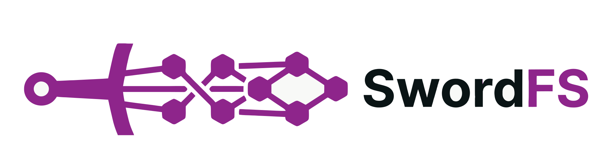

<p align="center"><a href="https://github.com/SwordInfra/SwordFS"></a></p>

# SwordFS

[](https://github.com/SwordInfra/SwordFS/actions/workflows/ci.yml?query=branch%3Amain)
[](https://codecov.io/gh/SwordInfra/SwordFS)

## What is SwordFS?
SwordFS is a modern, high-performance distributed filesystem project designed around [POSIX-style filesystem semantics](https://github.com/SwordInfra/SwordFS/blob/pjdfstest-status/status.md) and modern AI/ML workloads. The project aims to become a high-performance distributed filesystem platform for the AI/ML era while its open-source implementation continues to expand filesystem and backend coverage.

The major differences between SwordFS and other distributed file systems are as follows:
- High Performance: Performance is the top priority in SwordFS's architecture and feature design. That's why SwordFS is built with C++20, a battle-tested system programming language.
- Client-heavy: SwordFS is designed with heavy logic on the client side, so that the server-side I/O path is minimal. This is a direct result of the performance-first philosophy.
- AI/ML-oriented: SwordFS prioritizes high-throughput client-side data paths and an architecture that can evolve toward direct GPU/DPU and other accelerator-oriented integrations as those capabilities are implemented.

## Architecture
SwordFS uses a **client-heavy architecture**: filesystem semantics and most data-path logic live in the client, while durable metadata and file data are stored in external systems.

The current open-source implementation separates metadata from file data. Metadata can be backed by Memory or Redis, while file data is stored in S3-compatible object storage. This separation keeps filesystem logic independent from a particular storage service and leaves room for additional backends over time.

For architecture, core data structures, the thread model, and key workflow state machines, start with the **[design documentation](docs/README.md)**.


## POSIX Compatibility

SwordFS uses established filesystem and system test suites to track POSIX and Linux filesystem compatibility:

| Test suite | Status | Result | Details |
| --- | --- | --- | --- |
| [pjdfstest](https://github.com/pjd/pjdfstest) | Supported | **8770 / 8770 applicable assertions passing (100%)**, with **0 SwordFS known gaps** | [Compatibility report](https://github.com/SwordInfra/SwordFS/blob/pjdfstest-status/status.md) |
| [fstests / xfstests](https://github.com/kdave/xfstests) | In progress | Continuously tracked on `main` | [Progress report](https://github.com/SwordInfra/SwordFS/blob/fstests-status/status.md) |
| [stress-ng](https://github.com/ColinIanKing/stress-ng) | Planned | — | [#240](https://github.com/SwordInfra/SwordFS/issues/240) |

## Build

### Prerequisites

- **CMake** >= 3.19
- **Ninja** build system
- **C++20** compatible compiler (GCC >= 11, Clang >= 14)

### Clone

```bash
git clone --recurse-submodules https://github.com/SwordInfra/SwordFS.git
cd SwordFS
```

### Install Dependencies

Installs all required system packages (libfuse3-dev, build tools, folly build deps)
and downloads + builds folly. Already-installed components are skipped:

```bash
./scripts/install-deps.sh
```

### Build

```bash
# Debug build
cmake --preset default
cmake --build build

# Release build
cmake --preset release
cmake --build build
```

Or invoke Ninja directly:

```bash
cmake --preset default && ninja -C build
cmake --preset release && ninja -C build
```

### Pre-commit

SwordFS uses `pre-commit` for local formatting and repository hygiene checks. The C++ formatter
is pinned to clang-format 21.1.6, so local checks and CI use the same formatter version.

Install pre-commit with your platform's package manager or `pipx`, then enable the hooks:

```bash
pipx install pre-commit
pre-commit install
```

Run all hooks manually when needed:

```bash
pre-commit run --all-files
```

### Run Tests

Test dependencies (gtest) are fetched automatically via CMake's `FetchContent` — no manual
installation required.

```bash
# Configure, build, and run all tests in one go:
cmake --preset default && ninja -C build swordfs_test && ./build/swordfs_test
```

Or use CTest to run with filtering and parallel execution:

```bash
cmake --preset default && ninja -C build
cd build && ctest --test-dir . -V
```

## Acknowledgements
- [Folly](https://github.com/facebook/folly): A library of C++20 components designed with practicality and efficiency in mind, from Facebook.
- [JuiceFS](https://github.com/juicedata/juicefs): A high-performance POSIX file system designed for cloud-native environments. SwordFS draws significant inspiration from JuiceFS.
