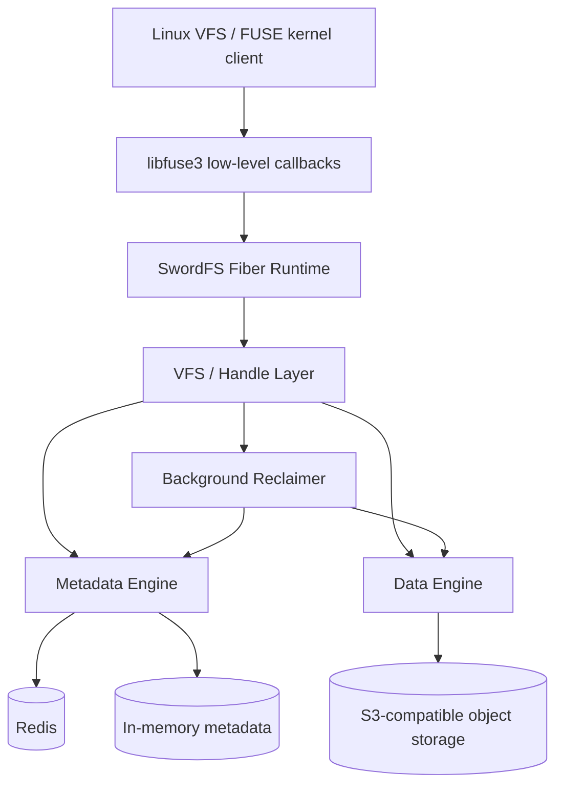
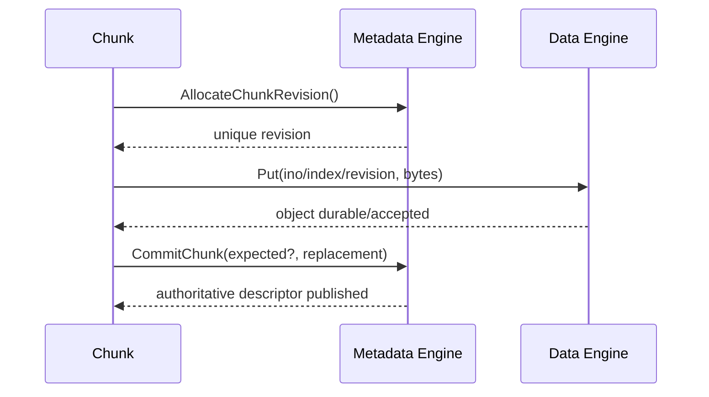
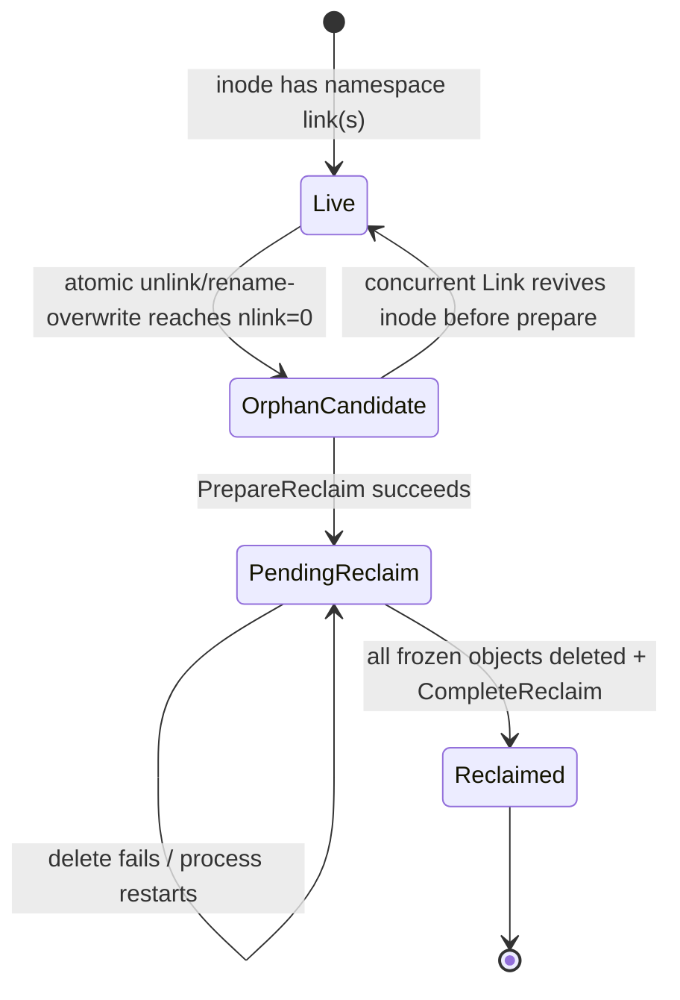

# SwordFS Architecture

This document is the canonical architecture description for the current open-source SwordFS implementation.

It is intentionally more detailed than the project README, but it is not a class-by-class or function-by-function reference. The goal is to explain the major subsystem boundaries, state ownership, request and data flow, correctness invariants, concurrency model, recovery model, and the most important current limitations in one continuous document.

The project README intentionally stays at a conceptual level. Internal interfaces, record layouts, publication protocols, concurrency mechanics, and recovery state machines belong here rather than being duplicated in README.

When implementation changes an architectural contract described here, the same PR should update this document.

Use the [documentation reading path](../README.md) to navigate the design.
Companion documents explain [data structures and ownership](data-structures.md),
the [thread model](thread-model.md), [chunk publication](chunk-publication.md),
and the [Redis storage model](redis-metadata-schema.md). This overview connects
those mechanisms through the main filesystem workflows.

## 1. Scope and architectural goals

SwordFS is a client-heavy user-space filesystem built on the libfuse3 low-level API. The client is responsible for POSIX-facing semantics, file/chunk state, metadata transactions, object-data placement, retries, and recovery coordination. The current open-source implementation relies on external systems for durable storage rather than implementing a new distributed metadata database or object store.

The architecture is guided by a few recurring principles:

- **Keep filesystem semantics in the client, storage primitives below it.** FUSE/VFS code owns filesystem behavior; metadata and data engines expose storage-oriented contracts.
- **Separate metadata authority from object data.** Namespace/inode/chunk descriptors live in the metadata engine; file bytes live in the data engine.
- **Publish immutable data identities through metadata.** Object data is written under a revisioned key first, then metadata atomically makes that revision authoritative.
- **Treat persistent metadata as the source of truth for lifecycle/recovery.** Local runtime state may fence or cache work, but must not become the only record of persistent work.
- **Make blocking external IO explicit.** Runtime filesystem logic executes as fibers; Redis/S3 calls run on POSIX worker threads through blocking executors.
- **Prefer clear state ownership over cross-layer reconstruction.** Each lifecycle transition should have one authoritative owner and a small set of explicit invariants.

The current implementation should be understood as an evolving architecture baseline. Some interfaces intentionally allow additional backends later, but this document distinguishes extension points from backends that exist today.

## 2. System overview

At a high level, SwordFS is split into five cooperating layers:



The major responsibilities are:

| Layer | Primary responsibility | Does not own |
| --- | --- | --- |
| FUSE hooks | Translate libfuse requests/replies and admit work into the fiber runtime | Filesystem state or persistence |
| VFS/handle layer | POSIX-facing orchestration, open-handle lifetime, file/chunk runtime state | Durable namespace storage implementation |
| Metadata engine | Authoritative inode, directory, chunk-descriptor, transaction, orphan/reclaim metadata | File object bytes |
| Data engine | Put/Get/Delete immutable file objects | Namespace/link/inode semantics |
| Reclaimer | Cross-engine deletion lifecycle after the last link disappears | Deciding namespace semantics |

`VolumeImpl` binds one mounted volume to one metadata engine and, when configured, one data engine. Backends are selected by URL scheme through registries rather than hard-coded into VFS code.

## 3. Process and mount lifecycle

SwordFS has two top-level commands relevant to architecture: `format` and `mount`.

### 3.1 Format

`swordfs format` creates the persistent volume configuration through the selected metadata backend.

The volume configuration contains, among other fields:

- volume name;
- data-engine identity;
- bucket/location string interpreted by that data engine;
- region;
- configured logical chunk size.

For Redis metadata, volume configuration is persisted in Redis. For the in-memory backend, only the volume configuration is persisted locally in `/etc/swordfs/<volume>/volume.fmt`; inode, directory, chunk, orphan, and pending-reclaim state remain process-lifetime state.

The persisted data-engine identity is authoritative for backend selection.
The bucket/location string is backend-specific configuration rather than a
second source of engine identity. A persisted volume either has both fields
populated or neither; volume decoding rejects a one-sided record. Mount then
selects the data engine solely from the validated persisted identity instead of
inferring it from the location or silently omitting the data plane. Persistent
metadata uses schema version 1; decoders require an exact match as part of
current-format validation.

### 3.2 Mount

The mount sequence is intentionally ordered so thread-owning components are created only after daemonization/forking:

1. validate/create the mount point;
2. daemonize when not running in foreground mode;
3. initialize `VolumeImpl`;
4. create and initialize the metadata engine;
5. load the persisted volume configuration;
6. create the data engine from the volume's persisted engine identity, then
   initialize it from the persisted backend-specific location/configuration;
7. create the libfuse low-level session and enter the multi-threaded FUSE loop;
8. initialize the first fiber runtime and the background reclaim worker from the FUSE init hook; other threads that submit filesystem work create their thread-local `FiberRuntime` lazily through `RunInFiber`.

At unmount, the reclaimer stops before the fiber runtime and storage engines are destroyed. This ordering prevents a background worker from borrowing an engine or fiber runtime after its lifetime has ended.

## 4. FUSE and VFS request path

SwordFS uses the **libfuse3 low-level API**, so callbacks operate on inode IDs rather than requiring high-level path reconstruction inside libfuse.

The FUSE hook layer is deliberately thin:

```text
kernel request
   -> libfuse low-level callback
   -> RunInFiber(...)
   -> set request context (uid/gid/pid)
   -> VfsImpl operation
   -> Status -> fuse_reply_*
```

`VfsImpl` is the main filesystem-orchestration boundary. It translates FUSE/POSIX operations into:

- direct metadata operations for namespace/attribute operations;
- `FileHandle`/`InodeHandle` operations for open file IO;
- `DirHandle`/metadata iterators for directory enumeration;
- wakeups to the background reclaimer after namespace changes that may create reclaim work.

Before dispatching an operation, the FUSE hook captures the request caller's `uid`, `gid`, `pid`, and `umask` into fiber-local `SwordFsContext`. With `default_permissions`, Linux VFS owns ordinary POSIX DAC, including pathname checks, supplementary groups, and capability overrides. Metadata uses the captured context for post-authorization semantics that still require caller identity, including ownership assignment and transaction-local sticky-directory ownership safety; it does not reconstruct a second mode-bit permission engine.

The current FUSE configuration is conservative around cache/coherency semantics:

- writeback cache is explicitly disabled;
- splice-write is explicitly disabled;
- splice-read is enabled when supported by the kernel/libfuse capability set;
- async read, readdirplus, and atomic truncate are enabled when available.

This matters because SwordFS currently owns dirty chunk state in userspace. Kernel writeback caching would otherwise hide important daemon-side write/flush/publication semantics.

## 5. Volume and backend abstraction

`VolumeImpl` is the process-level owner of the mounted volume's storage engines.

```text
VolumeImpl
  |- SwordFsVolume config
  |- IMetaEngine
  `- IDataEngine
```

Backend creation is registry-driven:

- `MetaEngineRegistry` creates a metadata engine from the metadata URL scheme;
- `DataEngineRegistry` creates a data engine from the persisted volume engine identity.

### 5.1 Implemented metadata backends

The current repository implements:

- **Memory** (`memory://local`) — process-lifetime inode/directory/chunk/reclaim state, useful for local operation and testing; only the volume configuration is persisted to a local file;
- **Redis** (`redis://...`) — persistent metadata backend with optimistic transactions.

The abstraction is intentionally backend-neutral, but other metadata engines should not be described as implemented until they actually exist in the repository.

### 5.2 Implemented data backend

The current repository implements an **S3-compatible data engine** selected through an `s3://...` bucket URL.

The S3 engine supports:

- object `Put`;
- ranged `Get`;
- idempotent `Delete` (deleting an already-absent immutable key is successful);
- optional bucket prefixing;
- MinIO/path-style access and virtual-hosted access configuration.

New data engines can be added through the registry without changing the VFS contract.

## 6. Metadata architecture

`IMetaEngine` is the filesystem's authoritative metadata contract. It covers:

- inode and attribute operations;
- directory entries and namespace mutations;
- hard/symbolic links;
- directory iteration;
- chunk descriptor allocation/publication/lookup;
- truncate;
- orphan and pending-reclaim lifecycle;
- volume format/load/statistics.

### 6.1 Metadata operation contract

Runtime metadata operations execute in the **fiber domain** and are required to be atomic with respect to concurrent observers.

For example, a rename that replaces an existing target cannot expose an intermediate state where the target is gone but the source has not yet moved. Backends may implement atomicity differently, but `IMetaEngine` defines one semantic result.

Lifecycle/control operations such as engine construction, initialization, format, load, and destruction execute in the **POSIX-thread domain**.

### 6.2 Core metadata model

The main logical records are:

- **`SwordFsInode`** — inode ID, POSIX-like attributes, parent inode, optional symlink target;
- **directory entry** — name/type/inode mapping owned by a directory;
- **`SwordFsChunk`** — one authoritative published chunk descriptor containing logical index, start offset, revision, and size;
- **volume configuration** — storage/backend configuration and chunk size;
- **orphan candidate** — inode whose last namespace link disappeared but which has not crossed the reclaim point of no return;
- **`ReclaimWork`** — frozen immutable object identities for an inode already removed from live metadata and awaiting/undergoing data deletion.

Metadata does **not** store mutable object bytes. For the current object-storage data path, it stores the revision necessary to derive the immutable object identity.

For relationships between these records, handles, and write buffers, see
[Data structures and ownership](data-structures.md).

### 6.3 Memory transaction model

The in-memory backend uses `MemMetaStore::Transact()` as its only mutation/operation entry point. A transaction holds one fiber mutex across the callback, so the callback is one atomic step relative to other metadata operations.

No pointers to mutable store-owned inode state escape the transaction. Reads use value snapshots and writes go through explicit transaction primitives.

The Memory backend mirrors persistent-backend semantics for correctness testing, including:

- orphan candidates;
- pending reclaim records;
- monotonically allocated chunk revisions;
- chunk publication and namespace atomicity.

The important difference is durability: these data structures do not survive process restart.

### 6.4 Redis layering

The Redis metadata implementation is split so filesystem policy, metadata semantics, and Redis mechanics remain distinct:

```text
RedisMetaImpl   - IMetaEngine policy/validation layer
    |
RedisMetaOps    - standalone operation orchestration / retry boundary
    |
RedisMetaTxn    - transaction-scoped filesystem metadata semantics
    |
RedisKvTxn      - WATCH / MULTI / EXEC mechanics
    |
RedisMetaClient - raw Redis access
```

Redis runtime calls are synchronous from the Redis client library's perspective, so they are executed on a `BlockingExecutor` POSIX thread pool while the calling fiber suspends on a baton.

All Redis keys belonging to one SwordFS volume currently share one Redis Cluster hash tag. This is an intentional transaction-locality trade-off: multi-key filesystem mutations can stay in one Redis transaction/slot, but a single volume is therefore not horizontally sharded across multiple Redis Cluster slots by the current schema.

### 6.5 Redis optimistic concurrency

`RedisKvTxn` enforces a read-before-write transaction discipline:

- transaction reads `WATCH` the relevant key;
- reads after the first queued write are rejected by the wrapper;
- writes are queued into `MULTI/EXEC`;
- a WATCH conflict is surfaced as a conflict so the operation can be retried at the operation layer.

Redis `MULTI/EXEC` is not a rollback transaction: an individual queued command may fail after earlier commands have succeeded. The transaction wrapper therefore validates EXEC replies and treats such outcomes as possible partial commits.

Timeout or connection loss after EXEC is treated as an **ambiguous commit**, not as proof that nothing happened. Metadata operations that can face ambiguous outcomes must therefore be idempotent or able to reconcile the resulting durable state.

Detailed Redis key layout and access patterns are documented separately in [Redis Metadata Schema and Access-Pattern Review](redis-metadata-schema.md). That document is a persistence-detail reference; this document remains the architecture entry point.

## 7. File-handle and inode runtime ownership

Open-file runtime state is deliberately separate from persistent inode metadata.

The main ownership chain is:

```text
FUSE file handle
  -> FileHandle
  -> shared InodeHandle (per inode within the mount)
  -> FileReadWriter
  -> FileChunkManager
  -> Chunk objects
```

`HandleManager` maps FUSE handle IDs to open `FileHandle`/`DirHandle` objects.

`InodeHandleManager` maintains shared per-inode handles through weak references so multiple opens in the same mount can share runtime state without keeping every inode alive forever.

`InodeHandle` owns two important runtime concepts:

- the count of live/opening descriptors;
- a local **reclaim fence**.

The reclaim fence prevents a background reclaim from crossing the metadata point of no return while a descriptor is open or still being opened. It is runtime safety state only; whether reclaim work exists is determined by durable metadata, not by an in-memory orphan flag.

The final close keeps its descriptor reference counted until its flush completes. This prevents reclaim from freezing/removing the inode while dirty data is still being flushed.

Directory handles follow the same separation of runtime and backend state. `DirHandle` owns a backend-neutral `DirIterator`; Memory can iterate an in-memory view while Redis keeps its private `HSCAN` cursor/prefetch state behind the iterator. The FUSE directory offset is a logical cookie and is not exposed as a Redis cursor.

READDIR and READDIRPLUS deliberately diverge only after entry enumeration. Plain
READDIR encodes `SwordFsEntry` records directly and never fetches inode metadata.
READDIRPLUS gathers a bounded batch of entries, asks `IMetaEngine::GetInodes()`
for the corresponding persistent inode records, composes any tracked/open local
inode overlay, and only then encodes `fuse_entry_param`. Memory serves the batch
under one metadata transaction; Redis uses one ordered `MGET` for the batch, so
PLUS does not create a per-entry metadata round trip.

The directory scan and attribute read are not one transaction-wide snapshot.
An entry whose inode disappears between enumeration and the batch attr read is
skipped; transport errors, malformed inode records, and inode-identity mismatch
remain hard errors. This makes concurrent unlink/rename behavior explicit
without returning fabricated attributes. If a concurrent rename moves an
already-enumerated name while its inode remains live, that observed pre-rename
name may still be returned with attributes bound to the same inode; directory
enumeration intentionally does not promise snapshot isolation.

Tracked/open state is composed onto the already-fetched persistent inode rather
than by calling `GetAttr()` again. The attr guard retains the `FileReadWriter`
whose shared operation lock it owns, so the lock and overlay source have one
RAII lifetime. In particular, a dirty file's live size is applied without a
second backend lookup, preserving the local coherence invariant while retaining
bounded Redis RTTs.

For tracked inodes, the persistent batch read and local overlay are one local
consistency window. `DirHandle` resolves the tracked handles in a batch,
deduplicates hard-linked inode IDs, orders them by inode ID, and holds each
file's shared operation lock across `GetInodes()` and overlay composition. A
concurrent local write, flush, truncate, or size-changing setattr therefore
cannot slip between the persistent snapshot and its live overlay. The batch is
bounded at 128 entries, so this can briefly delay writes to at most that many
tracked files for one backend batch-read RTT; the bound and single-RTT read are
the deliberate trade-off for avoiding both inconsistent mixed snapshots and an
N+1 metadata path.

READDIRPLUS currently uses zero entry and attribute cache timeouts. SwordFS has
no cross-mount dentry/inode invalidation or lease mechanism that would justify
caching directory-enumeration results; the previous one-second values were a
provisional implementation detail rather than a coherence guarantee.

## 8. Chunk and data model

Files are divided into fixed-size logical chunks. The default configured chunk size is 64 MiB, but the value is part of the volume configuration.

Each published chunk has a metadata descriptor:

```text
SwordFsChunk {
    index
    start_offset
    revision
    size
}
```

`revision` is a volume-wide monotonically allocated, non-zero identity. Allocated revisions may have gaps after failures, but a revision must not be reused while the volume's metadata remains authoritative.

For the current S3/object-storage engine, the physical object key is:

```text
<inode>/<chunk-index>/<revision>
```

This gives every published revision an immutable physical identity and allows metadata publication to change independently from an already-written object.

Within one inode, `FileReadWriter` uses a fiber read/write lock around file operations. Reads take the shared side, while write/flush/truncate-style state changes take the exclusive side. This allows concurrent reads without allowing local chunk publication/truncation state to race incompatible mutations on the same inode runtime object.

## 9. Write and publication path

The most important data-path invariant is:

> **Object bytes are written before the metadata descriptor that makes those bytes authoritative.**

### 9.1 Dirty chunk state

When a chunk does not yet exist in metadata, the local `Chunk` starts in a writing state with a `WriteBuf`. It is **not** inserted into persistent/shared chunk metadata merely because bytes were written locally.

This means unflushed data is local runtime state. A remote or restarted client cannot discover a partially written chunk through authoritative metadata.

### 9.2 Flush sequence

For a new chunk or a rewritten chunk, flush follows this sequence:



`CommitChunk` provides compare-and-swap semantics:

- first publication expects no existing descriptor;
- rewrite publication carries the previously authoritative descriptor as `expected`;
- replaying an already-published replacement is idempotent;
- a conflicting publication is rejected rather than silently overwriting the winner;
- after a **known** rewrite success, the superseded immutable revision is a
  best-effort cleanup candidate;
- after a **known** `AlreadyExists` / `NotFound`, the definitely losing
  uploaded revision is a best-effort cleanup candidate;
- cleanup registration failure may leak an obsolete object, but it does not
  change the known publication result.

The inode size side effect is reconciled as part of metadata publication and publication must not shrink inode size.

### 9.3 Rewrite behavior

The current object-storage path uses **whole-chunk copy-on-write** for overwrites of flushed chunks:

1. read the currently published object into a fresh write buffer;
2. apply the modification locally;
3. allocate a new revision;
4. upload a new full immutable object;
5. CAS-publish the new descriptor;
6. after a known successful publication, best-effort register the old
   immutable revision in `pending_deletes` and wake the background reclaimer.

The foreground rewrite path does not physically delete the previous object.
Physical deletion is centralized in `Reclaimer`, which rechecks authoritative
metadata before deleting any pending-delete candidate.

There is currently no slice/extent overlay or compaction layer in the open-source data path. Random overwrites can therefore incur whole-chunk read/write amplification.

## 10. Read path

`FileReadWriter` maps a byte range onto logical chunk indexes.

For each range:

- if a chunk is present in the local chunk map and contains data for that range, `Chunk::Read` serves it;
- a dirty/writing chunk reads from its local `WriteBuf`;
- a flushed chunk reads the authoritative revision from the data engine;
- holes are filled with zeroes up to the next chunk boundary.

Reads spanning multiple chunks may submit individual chunk reads as concurrent fibers, then wait for all of them before returning the assembled range.

S3 ranged reads write response data directly into the caller-provided buffer through a preallocated response stream, avoiding an intermediate string copy in the SwordFS data path.

## 11. Flush, fsync, close, and visibility

`FileReadWriter::Flush` walks locally cached flushable chunks and flushes each one. A successfully published chunk remains cached in `kClean` state so later reads use the authoritative published object identity.

An ordinary successful `write(2)` only means the bytes were accepted into this
mount's userspace `WriteBuf`; it is **not** a persistence acknowledgement. The
current VFS maps FUSE flush/fsync-style file operations to the userspace flush
path. A successful implemented flush/fsync means each flushed dirty chunk has
completed its object `Put` and received a known-success metadata publication.
The final descriptor close performs the same flush before releasing its last
open reference. `O_SYNC` / `O_DSYNC` write-through semantics are not currently
implemented.

SwordFS does not add an independent disk/replica barrier after the external
data/metadata engines acknowledge their operations. End-to-end power-loss
durability is therefore bounded by the durability configuration and completion
contract of those services (for example, Redis persistence/HA policy and the
object store's `Put` contract).

Cleanup of superseded or rejected immutable objects is deliberately outside
this persistence acknowledgement. Failure to register or execute cleanup may
leave garbage, but does not turn a known-success publication into failure.
Because writeback cache is disabled, SwordFS keeps direct control over dirty
chunk publication rather than depending on kernel writeback behavior to define
visibility.

On the final descriptor close, the `InodeHandle` keeps the reference alive until flush finishes, then releases the reference. The close path itself does not perform inode garbage collection; it wakes the background reclaimer so any durable orphan can be reconsidered promptly.

### 11.1 Open/close ordering against reclaim

The critical ordering is reference acquisition **before** metadata validation:

1. `Open` checks the local fence and increments the open count under the same
   lock. If reclaim already owns the fence, open fails.
2. It validates authoritative metadata after kernel authorization. `O_TRUNC`
   then truncates through the shared `FileReadWriter`. Failure releases the
   acquired reference.
3. Unlink may remove the last name while this reference exists. The inode
   remains an orphan candidate; reclaim cannot claim the local fence yet.
4. A non-final close drops its reference. The final close retains its reference
   during flush, then drops it even if flush returns an error. A close error
   must not be interpreted as successful persistence.
5. Once the count is zero, reclaim can claim the fence and attempt preparation.
   A concurrent open either acquired its reference first or sees the fence;
   it cannot pass between the fence check and count increment.

This fence covers one mount; it is not a distributed open-file lease. Flush
publishes chunks individually: if one fails, others may already be published.
It is not an atomic whole-file commit.

## 12. Truncate behavior

Truncate changes authoritative file metadata before it updates the local chunk
map. Cleanup completeness is not a precondition for the metadata mutation.

The per-inode exclusive operation lock covers this sequence:

1. Commit the new inode size and prune or clamp authoritative chunk
   descriptors. While doing so, the metadata backend records the exact
   descriptors detached by a **known-success** transaction as cleanup
   candidates for the caller.
2. Best-effort register those detached immutable identities in
   `pending_deletes`. Registration failure is logged and may leak garbage, but
   does not invalidate the already-known truncate result.
3. Drop cached chunks wholly beyond the new end and shorten the boundary
   chunk. For a dirty rewrite, also clamp its saved CAS expectation.
4. Wake the background reclaimer so pending-delete work is retried
   without waiting for the periodic scan.

Serializing size changes with writes and flushes prevents a local pending
write from racing truncate and republishing the removed range.

Pending-delete state is keyed by immutable object identity rather than by a
mutable inode-level batch. Repeated truncates therefore cannot overwrite an
earlier cleanup generation. Replay validates that the persisted Hash field,
frozen object key, descriptor-derived key, and canonical chunk layout all
agree before deleting data; malformed cleanup metadata fails closed. Queue
membership is never itself permission to delete: the reclaimer first checks
the current authoritative chunk descriptor and skips a candidate while that
same immutable object key is still live. This revalidation is required because
cleanup candidates can become stale relative to current authoritative metadata.

Whole chunks at or beyond the new EOF are detached and queued. A partial
boundary chunk is not queued for deletion because its immutable object remains
the backing object for the surviving prefix; only its authoritative descriptor
size is clamped.

Persistent backends drive truncate from **materialized chunk metadata**, not
from logical file length. Redis scans the actual `chunk:<ino>` Hash under the
optimistic transaction, so a huge sparse file costs O(materialized chunks)
rather than O(logical chunk positions).

## 13. Runtime and concurrency model

SwordFS intentionally defines exactly two execution domains:

1. **Fiber domain** — filesystem runtime/business logic actively executing as a Folly fiber;
2. **POSIX-thread domain** — normal threads used for lifecycle/control code and blocking external IO.

There is no generic or unknown third execution domain.

See [Thread model and synchronization](thread-model.md) for execution topology,
worker handoff, state protection, and the shutdown state machine.

### 13.1 Fiber runtime

FUSE callbacks submit work through `RunInFiber`. A `FiberRuntime` owns:

- a Folly `EventBase`;
- a driver thread;
- a FiberManager;
- admission/drain state used during shutdown.

Callbacks return after admitting work; the driver advances fibers asynchronously.

Shutdown first stops new task admission, waits for admitted fibers to drain, then terminates and joins the runtime driver.

### 13.2 Synchronization contract

SwordFS wraps synchronization primitives with semantic types:

- `FiberMutex` / `FiberRWMutex` — state owned by fiber-reachable business logic;
- `ThreadMutex` — state owned only by POSIX-thread control/blocking code;
- `FiberBaton` — cross-domain handoff/wakeup primitive.

In Debug builds these wrappers verify the current execution domain. The build also runs a `check_fiber_safety` target to reject raw synchronization primitives in production code where project rules require the semantic wrappers.

### 13.3 Blocking external IO

Redis and S3 client libraries perform blocking calls. SwordFS does not execute those calls directly on a fiber driver thread.

`BlockingExecutor::RunFromFiber`:

1. verifies the caller is in the fiber domain;
2. submits the blocking operation to a POSIX worker pool;
3. suspends the fiber on a baton;
4. resumes it after the worker posts completion.

This keeps the programming model synchronous at the filesystem call site while avoiding blocking the fiber scheduler's driver thread.

## 14. Namespace unlink and durable reclaim

Deleting a directory entry and deleting the underlying object data are intentionally separate phases.

When `unlink` or rename-overwrite drops a regular file's link count to zero, the metadata mutation atomically publishes an **orphan candidate**. The foreground VFS operation then wakes the background reclaimer and returns; it does not synchronously delete file objects.

This design ensures that a crash after the namespace mutation does not lose knowledge that cleanup is required.

### 14.1 Reclaim state machine



The **metadata point of no return** is `PrepareReclaim`.

In one atomic metadata transition it must:

1. re-check that the inode is still unlinked;
2. freeze the authoritative chunk descriptors and immutable object keys into pending reclaim work;
3. remove the live inode/chunk metadata and orphan marker so a later hard link cannot revive an inode whose data is being deleted.

After this point, the frozen `ReclaimWork` is the authority for deletion; live inode state is no longer consulted.

### 14.2 Open-file fence

Before preparing an orphan, the reclaimer acquires the inode's local reclaim fence from `InodeHandle`.

The fence can be acquired only when:

- no descriptor/open attempt holds an inode reference;
- no other local reclaim attempt owns the fence.

If a file has been unlinked while still open, the durable orphan remains in metadata and the worker simply retries later. The final close wakes the worker after its flush/reference release.

Once metadata preparation removes the live inode, the local fence can be released even while object deletion continues: new opens can no longer find the inode through authoritative metadata.

### 14.3 Background reclaimer

The `Reclaimer` is the sole production component that executes the cross-engine GC sequence:

1. replay one bounded batch of immutable-object pending-delete records from
   truncate and chunk publication cleanup, deleting each frozen object
   idempotently and acknowledging the record only after success;
2. replay already-pending last-link reclaim work;
3. scan orphan candidates;
4. acquire the local fence when applicable;
5. call `PrepareReclaim`;
6. delete every frozen object idempotently;
7. call `CompleteReclaim` only when all deletes succeed.

Its worker runs:

- once immediately at mount startup;
- after explicit wakeups from namespace/close activity;
- periodically as a safety scan.

Wakeups are coalesced. Failed object deletion leaves the pending record intact, so the next pass or a later mount can retry.

Pending-delete replay is deliberately bounded so a large object-cleanup
backlog cannot monopolize one reconciliation pass. The bound applies to visitor
work, while buffering is backend-specific: Redis pages through the durable set
with `HSCAN`; the Memory backend snapshots its in-process pending set once per
scan cycle so it can preserve progress across calls. The metadata backend
reports whether its current scan cycle has more work; the Reclaimer still
processes pending inode reclaims and orphan candidates in the current pass,
then self-wakes for another pending-delete batch. A still-authoritative stale
candidate therefore consumes only its current scan position and cannot
permanently pin later obsolete candidates behind it.

The Redis continuation cursor is process-local scheduling state, not durable
metadata. Restart begins a new scan at cursor zero; successfully registered
pending-delete records remain in Redis, and idempotent deletion/acknowledgement
makes revisiting an item safe. Registration itself is best effort: a missing
record may leak an obsolete object but cannot authorize deletion of live data.

One completed Redis cursor cycle is not a claim that no new cleanup record
exists: SCAN does not promise to return entries added during the iteration.
Concurrent producers still wake the worker, and the periodic safety scan
provides a bounded fallback when that wake is coalesced with continuation of
the current cycle.

## 15. Crash, retry, and ambiguous-result principles

Several architecture rules exist specifically because external systems can fail after partially completing an operation.

### 15.1 Chunk publication

Writing the object before metadata publication means a failure can leave an **unreferenced object**, but it must not expose metadata that points at data which was never successfully uploaded.

Retry logic first checks authoritative metadata:

- if the same replacement descriptor was already published, the operation can complete idempotently;
- if another revision won and publication returns a known logical rejection,
  the losing uploaded revision is terminal locally and is best-effort
  registered for background cleanup;
- if publication outcome is ambiguous, retry retains the same uploaded
  candidate and resolves authoritative metadata before deciding whether the
  object is live or obsolete;
- once a revision receives a definite rejection, the local writer relinquishes
  it and any later retry allocates a fresh revision, because background cleanup
  may already have been registered for the rejected immutable key.

For rewrites, a known successful publication makes the superseded old revision
a cleanup candidate; registration happens afterward and is best effort. A crash
or cleanup-registration failure may therefore leave an unreachable object. The
same is true for a successful object `Put` whose later publication outcome is
never resolved. These are accepted garbage/space leaks, not reader-visible
corruption: no physical delete occurs without authoritative metadata proving
the exact immutable key is no longer live.

### 15.2 Redis transaction ambiguity

After Redis EXEC, a timeout or connection close does not prove whether the server committed the transaction. Callers must treat the result as ambiguous and rely on idempotent/reconciliation-aware metadata operations rather than assuming rollback.

### 15.3 Reclaim

After `PrepareReclaim`, failure is recoverable because the durable pending record contains the exact immutable object identities still to delete. `CompleteReclaim` is delayed until deletion succeeds.

Rewrite/truncate cleanup deliberately uses a weaker contract than last-link
reclaim. After a known metadata outcome, obsolete immutable identities are
best-effort registered in `pending_deletes`; registration or later deletion
failure may leave garbage. The safety rule is stronger and simpler: every
physical pending-delete operation re-reads authoritative chunk metadata and
must not delete an object whose exact immutable key is still live.

The architecture generally prefers **leaking unreachable data over deleting reachable data** when a failure leaves uncertainty.

## 16. Performance-sensitive design choices

The current implementation contains several deliberate choices intended to keep the client data path efficient:

- low-level FUSE avoids high-level path resolution in libfuse;
- multi-chunk reads can execute chunk reads concurrently in fibers;
- Folly `IOBuf` is used to reduce avoidable data copies;
- S3 Put wraps the existing buffer instead of first materializing a temporary string;
- S3 Get can stream directly into caller-provided writable buffer space;
- Redis and S3 blocking calls use dedicated POSIX worker pools;
- metadata/data backend interfaces keep VFS independent from backend-specific connection/client objects;
- immutable revisioned object identities allow lock-free object naming at the data-store level and move authority changes into metadata transactions.

There are also known performance costs in the current design:

- rewriting a published object-storage chunk hydrates and rewrites the whole chunk;
- there is no slice/extent delta representation or background compaction path;
- S3 multipart upload is not currently supported by the data engine;
- metadata and data path are client-heavy, so client CPU/thread/fiber behavior directly affects filesystem performance.

These costs should be treated as design constraints for future work, not hidden implementation details.

## 17. Current capability boundaries

The architecture described above covers the implemented open-source path. Several FUSE operations are currently explicit `NotSupported` paths, including:

- extended attributes (`setxattr`, `getxattr`, `listxattr`, `removexattr`);
- `flock`;
- `fallocate`;
- `tmpfile`;
- `statx`;
- `ioctl` and retrieve-reply handling;
- `fsyncdir`;
- `lseek` specialization.

These should not be inferred from the broad project mission as already implemented semantics.

Special-node namespace creation is implemented through the low-level FUSE
`mknod` path for regular files, FIFOs, character devices, block devices, and
socket nodes. The authoritative type/mode/device identity is persisted by the
metadata engine and returned in the successful FUSE entry reply; ordinary
authorization remains owned by the kernel/FUSE boundary.

The current open-source backend set is also intentionally narrower than possible future architecture:

- metadata: Memory and Redis;
- data: S3-compatible object storage.

Additional metadata/data engines are extension opportunities through the registries, not current capabilities unless present in the repository.

## 18. Architectural invariants for future changes

Future changes should preserve or explicitly revise the following contracts:

1. **Authoritative metadata operations are atomic.** Namespace observers must not see intermediate composite-operation state.
2. **Runtime filesystem metadata operations execute in the fiber domain; blocking backend IO executes in POSIX worker threads.**
3. **Unpublished chunk data is not authoritative shared metadata.** A chunk becomes authoritative only after object write + `CommitChunk` publication.
4. **Published object identities are immutable and revisioned.** Revisions are volume-scoped, non-zero, monotonic, and not reused.
5. **Rewrite publication is conditional.** A stale writer must not overwrite a newer authoritative chunk descriptor.
6. **Open-handle runtime state does not replace durable metadata.** Local fences protect transitions; they are not persistent lifecycle records.
7. **Last-link deletion is recoverable.** The metadata mutation that removes the last name must durably publish cleanup work before the foreground request can forget the inode.
8. **Object deletion after reclaim uses frozen identities.** It must not reconstruct targets from mutable/live metadata after the point of no return.
9. **Immutable-object cleanup is best effort, but deletion safety is strict.**
   Rewrite/truncate may leave unreachable objects if cleanup registration or
   execution fails. A pending-delete record is only a candidate; Reclaimer
   must revalidate authoritative metadata and never delete the same immutable
   key while it is still live.
10. **Data-engine deletion is idempotent.** Registered cleanup may replay the same immutable key after restart, timeout, or acknowledgement failure.
11. **Ambiguous external commits are not assumed to have rolled back.** Retry/reconciliation semantics must be safe under either outcome.
12. **Shutdown ordering respects borrowed lifetimes.** Background work stops before the fiber runtime and engines it uses are destroyed.

Any PR that changes one of these invariants should update this document as part of the same change.

## 19. Known evolution areas

The following areas are intentionally not presented as solved architecture:

- whole-chunk object-store rewrite amplification remains until a different data representation is introduced;
- multi-mount/session ownership semantics are not represented by a distributed lease/session layer in the current architecture;
- reclaim pending-work representation and progress tracking can be made more storage-native/compact over time;
- GC backlog/age/throughput observability is still limited;
- additional data and metadata backends may require revisiting capability contracts rather than simply registering a new factory.

These areas should be documented here when their architecture becomes concrete, rather than described as existing capability in advance.

## 20. Code map and deeper references

The most useful source entry points are:

| Area | Main source |
| --- | --- |
| mount/volume lifetime | `src/cmd/Mount.cpp`, `src/volume/VolumeImpl.*` |
| FUSE admission/replies | `src/fuse/Vfs.*` |
| VFS semantics | `src/vfs/VfsImpl.*` |
| open handles/runtime state | `src/vfs/FileHandle.*`, `src/vfs/InodeHandle.*`, `src/vfs/DirHandle.*` |
| file/chunk IO | `src/vfs/FileReadWriter.*`, `src/chunk/Chunk.*`, `src/chunk/WriteBuf.*` |
| metadata abstraction | `src/metadata/IMetaEngine.hpp` |
| Memory metadata | `src/metadata/mem/` |
| Redis metadata | `src/metadata/redis/` |
| data-engine abstraction | `src/storage/IDataEngine.hpp` |
| S3 data engine | `src/storage/s3/` |
| runtime/concurrency | `src/utils/FiberRuntime.*`, `src/utils/BlockingExecutor.*`, `src/utils/Synchronization.hpp` |
| reclaim/recovery | `src/vfs/Reclaimer.*`, `src/metadata/types/Reclaim.*` |

For Redis persistence details, see [Redis metadata: storage and transactions](redis-metadata-schema.md).
