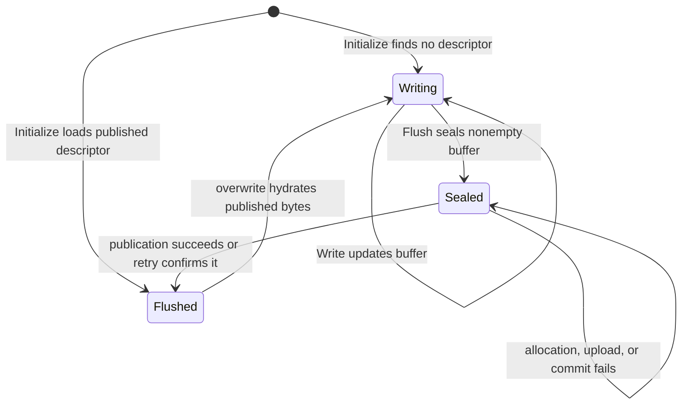

# Chunk Publication Contract

SwordFS stores each flushed chunk as an immutable object and publishes a
descriptor for that object through the metadata engine. The object and its
metadata are intentionally separate durability domains, so their ordering is
the publication protocol.

## Invariants

1. Local dirty bytes are visible only to handles sharing the local
   `FileReadWriter`. A new chunk has no persistent descriptor; a dirty rewrite
   leaves the old published descriptor authoritative until replacement commits.
2. `IDataEngine::Put()` returning `OK` means the complete immutable object is
   atomically readable under its revision-qualified key.
3. `IMetaEngine::CommitChunk()` is the reader-visibility barrier. A descriptor
   may be committed only after its object upload succeeds. Cleanup of an old
   or definitely rejected immutable revision is a separate best-effort
   maintenance action after a **known** publication outcome; cleanup
   completeness is not part of publication correctness.
4. A bounded successful `Chunk::Read()` returns exactly the requested bytes.
   It validates the bytes appended by `IDataEngine::Get()`; short data is an
   I/O error, never a successful chunk read.

The resulting publication order is:

```text
local write buffer
       |
       v
allocate unique revision
       |
       v
Put complete immutable object
       |
       v
CommitChunk descriptor with CAS
       |
       v
readers may resolve the object
```

No `Writing` or `Uploading` record is stored in metadata. Readers therefore
have only two persistent states to interpret: no descriptor (a hole) or a
descriptor for a completed object.

## Local state machine

These states belong to the local `Chunk`, not to persistent metadata:



| State | Retained state | Read/write behavior |
| --- | --- | --- |
| `kWriting` | Write buffer; old descriptor if rewriting | Reads local bytes; accepts writes |
| `kSealed` | Buffer, old CAS expectation, pending revision once allocated | Reads local bytes; rejects writes; flush can retry |
| `kFlushed` | Published descriptor; buffer released | Reads object data; overwrite must hydrate a new buffer |

An empty buffer does not need sealing or publication. Hydration failure leaves
the chunk flushed with its previous descriptor. A definite publication
conflict leaves the local chunk sealed and returns an error; there is no
automatic merge or transition back to writing.

## Persistence acknowledgement

An ordinary successful `write(2)` only copies bytes into the local `WriteBuf`.
It does not acknowledge persistence. The implemented persistence boundary is a
successful flush/fsync/final-close flush: each relevant dirty chunk has a
successful object `Put` and a known-success `CommitChunk` result. `O_SYNC` and
`O_DSYNC` write-through are not currently implemented.

This is an application-level ordering contract between SwordFS and its
external engines, not an extra storage barrier. Redis/object-store
acknowledgements are only as durable as those services are configured to be.
Pending-delete registration and physical garbage collection are outside this
acknowledgement.

## Flush and retry steps

`FileReadWriter` holds its exclusive operation lock while flushing a snapshot
of flushable chunks. Each chunk progresses independently; the file-level flush
tries the remaining chunks after a failure and returns its first error.

1. Seal a nonempty writing buffer so the pending payload cannot change.
2. Allocate a pending revision if none is retained from an earlier attempt.
3. On retry, read the authoritative descriptor before uploading again:
   - If it equals the replacement, replay `CommitChunk` idempotently and finish.
   - If it still equals the old expectation, continue the upload/publication.
   - If a different descriptor won and the pending object was already uploaded,
     replay `CommitChunk` so metadata can establish a **known** outcome. A
     known rejection makes that revision terminal locally and may best-effort
     register it for background cleanup.
   - A missing descriptor is valid for first publication; it is an error when
     a rewrite expected an existing descriptor. Other lookup errors propagate.
4. Upload the complete buffer under the pending revision's object key.
5. CAS-publish the replacement using the old descriptor, or absence for a new
   chunk, as the expectation. An ambiguous failure retains the sealed state,
   pending revision, and knowledge that the object upload succeeded.
6. On success, retain the new descriptor, clear the pending revision, release
   the write buffer, and enter `kFlushed`. Metadata best-effort registers the
   superseded old revision for `Reclaimer` cleanup and the VFS wakes the
   background worker. The producer performs no physical object delete.

Once metadata has **definitely rejected** an uploaded revision, that revision
is terminal for the local `Chunk`: it is relinquished and a later retry
allocates a fresh revision. Cleanup registration is best effort, but if it did
succeed the background Reclaimer may already be eligible to delete that key;
reusing the revision would therefore violate immutable-key safety.

`CommitChunk` is the visibility boundary. Cleanup registration/deletion failure
after successful publication does not revert that publication; at worst the
obsolete immutable object leaks. Local runtime state provides ambiguous-outcome
retry information only while the process retains the chunk.

## Failure and crash windows

| Failure point | Persistent result | Reader-visible result |
| --- | --- | --- |
| Before/during failed `Put` | No object is guaranteed; no metadata commit is attempted | The new chunk is not visible |
| After successful `Put`, before a known `CommitChunk` result | A complete object may be live or unreachable; a crash can leave garbage | Only an actually committed descriptor is visible |
| `CommitChunk` returns a definite conflict / missing expected descriptor | The losing revision is terminal locally and best-effort registered for cleanup; registration failure may leak it | The winning descriptor remains authoritative |
| `CommitChunk` result is ambiguous | Retry resolves the authoritative descriptor before another publication attempt | A committed matching descriptor can be completed idempotently |
| After successful rewrite `CommitChunk` | Replacement is authoritative; superseded revision is best-effort registered for cleanup | The replacement chunk is readable |

The object-only crash windows are accepted under the current product contract:
they may leak storage but do not weaken the visibility invariant because
authoritative metadata never points to an object whose `Put` was not known to
have succeeded. A future inventory/sweeper may reclaim such residue without
changing this publication protocol.

## Cleanup authority

`pending_deletes` stores maintenance candidates, not permission to delete.
`Reclaimer` always reads current authoritative chunk metadata before physical
deletion. If the same immutable key is still live, it skips that candidate.
This rule prevents stale maintenance state from deleting an object that is
currently authoritative; queue membership alone never grants delete authority.

## Why there is no post-upload `HEAD`

The data engine's successful `Put()` result is the completion contract. S3
single-key PUTs are atomic and strongly read-after-write consistent; another
`HEAD` would add a storage round trip without strengthening atomicity. Backends
that cannot provide this contract must not return `OK` from `Put()` until they
have established equivalent semantics.

Read-side exact-length validation remains mandatory. It detects a backend that
violates the contract, external object corruption/truncation, and stale or
malformed metadata without exposing unwritten buffer capacity to callers.
