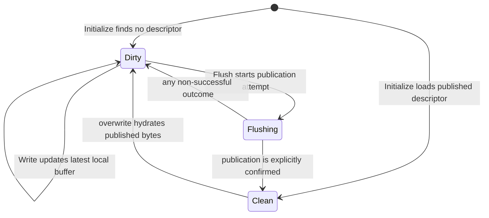

# Chunk Publication Contract

SwordFS stores each flushed chunk as an immutable object and publishes a
descriptor for that object through the metadata engine. The object and its
metadata are intentionally separate durability domains, so their ordering is
the publication protocol.

## Invariants

1. Local dirty bytes are visible only to handles sharing the local
   `FileReadWriter`. A new chunk has no persistent descriptor; a dirty rewrite
   leaves the old published descriptor authoritative until replacement commits.
2. `IDataEngine::Put()` returning `OK` means the complete immutable object is
   atomically readable under its revision-qualified key.
3. `IMetaEngine::CommitChunk()` is the reader-visibility barrier. A descriptor
   may be committed only after its object upload succeeds. Cleanup of an old
   or definitely rejected immutable revision is a separate best-effort
   maintenance action after a **known** publication outcome; cleanup
   completeness is not part of publication correctness.
4. A bounded successful `Chunk::Read()` returns exactly the requested bytes.
   It validates the bytes appended by `IDataEngine::Get()`; short data is an
   I/O error, never a successful chunk read.

The resulting publication order is:

```text
local write buffer
       |
       v
allocate unique revision
       |
       v
Put complete immutable object
       |
       v
CommitChunk descriptor with CAS
       |
       v
readers may resolve the object
```

No `Writing` or `Uploading` record is stored in metadata. Readers therefore
have only two persistent states to interpret: no descriptor (a hole) or a
descriptor for a completed object.

## Local state machine

These states belong to the local `Chunk`, not to persistent metadata:



| State | Retained state | Read/write behavior |
| --- | --- | --- |
| `kDirty` | Complete latest local buffer; last known published descriptor when rewriting | Reads local bytes; accepts writes |
| `kFlushing` | Same local buffer plus one transient immutable publication attempt | Synchronous transient state under the file operation lock |
| `kClean` | Confirmed authoritative descriptor; clean buffer retention is a separate cache policy | Reads authoritative data; overwrite becomes dirty |

`kFlushing` is not a durable lifecycle state. Every non-successful allocation,
upload, metadata commit, or reconciliation result returns the chunk to
`kDirty`, preserving the complete latest local buffer as writable and
retryable. An empty dirty buffer does not need publication. Hydration failure
leaves the chunk clean with its previous descriptor.

Publication retry state is separate from chunk data state. A failed attempt's
revision is never reused by a later Flush, even when the local payload has not
changed. The next retry first refreshes the authoritative chunk descriptor,
then allocates a new immutable revision and republishes the complete latest
local buffer from that CAS baseline. This deliberately trades exceptional-path
object I/O for a smaller correctness state machine: the client does not need to
remember whether an old candidate was uploaded, whether its payload is still
current, or whether that revision remains reusable.

## Persistence acknowledgement

An ordinary successful `write(2)` only copies bytes into the local `WriteBuf`.
It does not acknowledge persistence. The implemented persistence boundary is a
successful flush/fsync/final-close flush: each relevant dirty chunk has a
successful object `Put` and a known-success `CommitChunk` result. `O_SYNC` and
`O_DSYNC` write-through are not currently implemented.

This is an application-level ordering contract between SwordFS and its
external engines, not an extra storage barrier. Redis/object-store
acknowledgements are only as durable as those services are configured to be.
Pending-delete registration and physical garbage collection are outside this
acknowledgement.

## Flush and retry steps

`FileReadWriter` holds its exclusive operation lock while flushing a snapshot
of flushable chunks. Each chunk progresses independently; the file-level flush
tries the remaining chunks after a failure and returns its first error.

1. Transition the nonempty chunk from `kDirty` to transient `kFlushing`.
2. If any earlier Flush attempt returned a non-success status, refresh the
   authoritative descriptor with `FindChunk` before retrying. An existing
   descriptor becomes the new cached CAS baseline; `NotFound` establishes an
   absent baseline; other lookup failures remain observable and leave the
   chunk dirty. This reconciliation round trip exists only on retry/failure
   paths; a normal first-attempt successful Flush does not pay it.
3. Allocate a fresh revision for every publication attempt. A revision from a
   failed or ambiguous attempt is abandoned and never retried. The metadata
   engine's volume-scoped monotonic allocator guarantees this new revision is
   newer than any authoritative revision observed during the refresh.
4. Upload the complete local buffer under the revision-qualified object key.
5. CAS-publish the replacement using the current authoritative descriptor, or
   absence for a new chunk, as this attempt's expectation.
6. Only a known-success `CommitChunk` for the fresh attempt transitions
   `kFlushing` to `kClean`. Successful publication retains the descriptor
   and clears the retry-refresh state.
7. Any non-successful result returns `kFlushing` to `kDirty` and returns the
   error to the caller. The latest local bytes stay writable and retryable,
   and the next Flush refreshes its metadata baseline before allocating
   another fresh revision.

Every failed Flush marks the next retry for authoritative refresh, including a
revision-allocation failure where no candidate object exists yet. Whenever a
revision was allocated for a failed attempt, that revision is never reused.
This single rule covers definite metadata rejection, ambiguous metadata
errors, failed/ambiguous `Put()`, and payload changes without separate
candidate-reuse cases.

`CommitChunk` is the visibility boundary. Cleanup registration/deletion failure
after successful publication does not revert that publication; at worst the
obsolete immutable object leaks. A candidate abandoned after an ambiguous
failure may also leak if no safe cleanup record was established. Retry
correctness does not depend on reclaiming that object, and foreground code must
not delete an uncertain candidate without authoritative-state revalidation.

## Failure and crash windows

| Failure point | Persistent result | Reader-visible result |
| --- | --- | --- |
| Before/during failed `Put` | No object is guaranteed; no metadata commit is attempted; the candidate revision is abandoned | The local chunk returns to `kDirty`; the next Flush refreshes metadata and uses a new revision |
| After successful `Put`, before a known `CommitChunk` result | A complete object may be live or unreachable; a crash can leave garbage | Only an actually committed descriptor is visible; the local chunk stays dirty/retryable |
| `CommitChunk` returns a definite conflict / missing expected descriptor | That candidate revision is terminal and may be registered for cleanup; registration failure may leak it | A later retry refreshes the authoritative descriptor and publishes the latest local data with a fresh revision |
| `CommitChunk` result is ambiguous | The old candidate may or may not be authoritative; retry reads the current descriptor but never reuses the old revision | If the old candidate is authoritative it becomes only the CAS baseline for a newer revision; otherwise the observed descriptor/absence becomes that baseline |
| After successful rewrite `CommitChunk` | Replacement is authoritative; superseded revision is best-effort registered for cleanup | The replacement chunk is readable |

The object-only crash windows are accepted under the current product contract:
they may leak storage but do not weaken the visibility invariant because
authoritative metadata never points to an object whose `Put` was not known to
have succeeded. A future inventory/sweeper may reclaim such residue without
changing this publication protocol.

A separate metadata mutation such as truncate/setattr can also return an error
after changing the authoritative chunk descriptor. In that case the local dirty
buffer remains complete and writable. Any earlier failed Flush already marks
the next retry for authoritative refresh; if a first attempt instead discovers
the stale descriptor through a definite CAS rejection, that failure sets the
same retry-refresh state. The following Flush rebases on current metadata and
republishes the latest complete local buffer with a fresh revision. The failed
metadata call is never silently converted to success.

## Cleanup authority

`pending_deletes` stores maintenance candidates, not permission to delete.
`Reclaimer` always reads current authoritative chunk metadata before physical
deletion. If the same immutable key is still live, it skips that candidate.
This rule prevents stale maintenance state from deleting an object that is
currently authoritative; queue membership alone never grants delete authority.

## Why there is no post-upload `HEAD`

The data engine's successful `Put()` result is the completion contract. S3
single-key PUTs are atomic and strongly read-after-write consistent; another
`HEAD` would add a storage round trip without strengthening atomicity. Backends
that cannot provide this contract must not return `OK` from `Put()` until they
have established equivalent semantics.

Read-side exact-length validation remains mandatory. It detects a backend that
violates the contract, external object corruption/truncation, and stale or
malformed metadata without exposing unwritten buffer capacity to callers.
