# Chunk Publication Contract

SwordFS stores each flushed chunk as an immutable object and publishes a
descriptor for that object through the metadata engine. The object and its
metadata are intentionally separate durability domains, so their ordering is
the publication protocol.

## Invariants

1. Local dirty bytes are visible only to handles sharing the local
   `FileReadWriter`. A new chunk has no persistent descriptor; a dirty rewrite
   leaves the old published descriptor authoritative until replacement commits.
2. `IDataEngine::Put()` returning `OK` means the complete immutable object is
   atomically readable under its revision-qualified key.
3. `IMetaEngine::CommitChunk()` is both the reader-visibility barrier and the
   durable cleanup handoff for known rewrite outcomes. A descriptor may be
   committed only after its object upload succeeds; before a rewrite makes the
   old descriptor obsolete, metadata must durably retain that old immutable
   identity for background deletion.
4. A bounded successful `Chunk::Read()` returns exactly the requested bytes.
   It validates the bytes appended by `IDataEngine::Get()`; short data is an
   I/O error, never a successful chunk read.

The resulting publication order is:

```text
local write buffer
       |
       v
allocate unique revision
       |
       v
Put complete immutable object
       |
       v
CommitChunk descriptor with CAS
       |
       v
readers may resolve the object
```

No `Writing` or `Uploading` record is stored in metadata. Readers therefore
have only two persistent states to interpret: no descriptor (a hole) or a
descriptor for a completed object.

## Local state machine

These states belong to the local `Chunk`, not to persistent metadata:

```mermaid
stateDiagram-v2
    [*] --> Writing: Initialize finds no descriptor
    [*] --> Flushed: Initialize loads published descriptor
    Writing --> Writing: Write updates buffer
    Writing --> Sealed: Flush seals nonempty buffer
    Sealed --> Sealed: allocation, upload, or commit fails
    Sealed --> Flushed: publication succeeds or retry confirms it
    Flushed --> Writing: overwrite hydrates published bytes
```



| State | Retained state | Read/write behavior |
| --- | --- | --- |
| `kWriting` | Write buffer; old descriptor if rewriting | Reads local bytes; accepts writes |
| `kSealed` | Buffer, old CAS expectation, pending revision once allocated | Reads local bytes; rejects writes; flush can retry |
| `kFlushed` | Published descriptor; buffer released | Reads object data; overwrite must hydrate a new buffer |

An empty buffer does not need sealing or publication. Hydration failure leaves
the chunk flushed with its previous descriptor. A definite publication
conflict leaves the local chunk sealed and returns an error; there is no
automatic merge or transition back to writing.

## Flush and retry steps

`FileReadWriter` holds its exclusive operation lock while flushing a snapshot
of flushable chunks. Each chunk progresses independently; the file-level flush
tries the remaining chunks after a failure and returns its first error.

1. Seal a nonempty writing buffer so the pending payload cannot change.
2. Allocate a pending revision if none is retained from an earlier attempt.
3. On retry, read the authoritative descriptor before uploading again:
   - If it equals the replacement, replay `CommitChunk` idempotently and finish.
   - If it still equals the old expectation, continue the upload/publication.
   - If a different descriptor won, establish durable pending-delete ownership
     for the already-uploaded losing revision, then return conflict; foreground
     deletion is only an eager optimization.
   - A missing descriptor is valid for first publication; it is an error when
     a rewrite expected an existing descriptor. Other lookup errors propagate.
4. Upload the complete buffer under the pending revision's object key.
5. CAS-publish the replacement using the old descriptor, or absence for a new
   chunk, as the expectation. Redis rewrite publication first commits the old
   immutable identity in an additive-only pending-delete transaction, then the
   destructive publication transaction revalidates that intent before
   replacing the descriptor. An ambiguous failure retains sealed state.
6. On success, retain the new descriptor, clear the pending revision, release
   the write buffer, and enter `kFlushed`. Eagerly delete the old object when
   possible and acknowledge its pending-delete record only after deletion
   succeeds.

Once metadata has durably classified an uploaded revision as a definite loser,
that revision is terminal for the local `Chunk`: it must be relinquished even
when eager object deletion fails. A later retry allocates a fresh revision.
Otherwise an initial-publication retry could republish an immutable key that is
already present in `pending_deletes` and is therefore concurrently eligible for
background deletion.

`CommitChunk` is the visibility boundary. Cleanup failure after successful
publication does not revert that publication because the obsolete immutable
identity is already durable metadata-owned work. Local runtime state provides
retry information only while the process retains the chunk.

## Failure and crash windows

| Failure point | Persistent result | Reader-visible result |
| --- | --- | --- |
| Before/during failed `Put` | No object is guaranteed; no metadata commit is attempted | The new chunk is not visible |
| After successful `Put`, before the first `CommitChunk` metadata handoff | A complete but unreachable object may remain | The new chunk is not visible |
| `CommitChunk` returns a definite conflict / missing expected descriptor | The losing revision is durably queued for deletion before the logical error is exposed | The winning descriptor remains authoritative |
| `CommitChunk` result is ambiguous | Retry resolves the authoritative descriptor before another publication attempt | A committed matching descriptor can be completed idempotently |
| After successful rewrite `CommitChunk` | Replacement is authoritative; superseded revision is durable pending-delete work | The replacement chunk is readable |

The remaining object-only crash window before any `CommitChunk` metadata
handoff requires a publication-intent/fencing lifecycle and is tracked by
GitHub issue #186. It does not weaken the visibility invariant because no
metadata descriptor references that object.

## Why there is no post-upload `HEAD`

The data engine's successful `Put()` result is the completion contract. S3
single-key PUTs are atomic and strongly read-after-write consistent; another
`HEAD` would add a storage round trip without strengthening atomicity. Backends
that cannot provide this contract must not return `OK` from `Put()` until they
have established equivalent semantics.

Read-side exact-length validation remains mandatory. It detects a backend that
violates the contract, external object corruption/truncation, and stale or
malformed metadata without exposing unwritten buffer capacity to callers.
