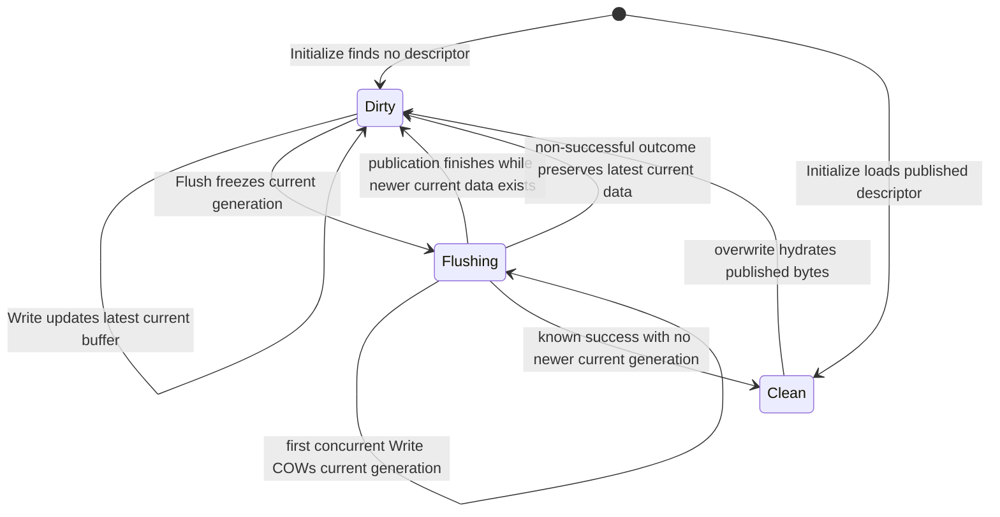

# Chunk Publication Contract

## Volume-fixed overwrite strategy

The formatted volume records one stable `ChunkOverwriteMechanism` enum value
and its index-format version. Human-readable names such as `whole_object` are
accepted only at the CLI/configuration boundary and are converted there to the
typed value. Mount constructs one implementation from the persisted enum;
runtime strategy selection and private-index namespacing do not carry or
compare arbitrary mechanism strings. There is no per-file or per-chunk
mechanism tag and no live switching. Until the chunk-slice implementation is
activated by #270–#275, the existing immutable whole-object path is the only
selectable implementation. Known but unimplemented enum values such as
`chunk_slice` and `redis_cache` are rejected by strategy construction.

Directory entries, inodes, and the file-to-logical-chunk head are shared. A
logical chunk's file offset is derived from its fixed-layout identity as
`chunk_index * chunk_size`; `start_offset` is not persisted in the common
record. During the staged #312 refactor, the common head still temporarily
carries logical size and a publication revision because existing publication,
truncate, and cleanup code consumes them. Those fields are transitional rather
than part of the target common contract and will be removed only after the
corresponding mechanism-private state becomes authoritative. The selected
mechanism owns the chunk session, its internal index schema and operations,
the translation from private index state to physical data, and cleanup
validation/deletion.

The metadata backend supplies a transaction-scoped `IChunkIndexTxn` with
private hash read, scan, put, and erase operations. The strategy's
`IChunkIndexParticipant` uses that surface in the same Memory or Redis
transaction as the common head and inode size. Publication, truncate/setattr
size changes, and orphan preparation are the coordination points. Cleanup
freeze callbacks can read that private index through the same transaction to
capture the exact physical references being detached. A strategy can use
multiple private records per chunk; the common head and transaction protocol
do not prescribe a fragment list or one physical reference. Private index
keys are namespaced by the typed mechanism selection and interpreted only by
that implementation; a future Redis-cache implementation does not reuse or
interpret the chunk-slice index.

A chunk session supplies an opaque `ChunkPublishIntent` after making its new
data durable. `CommitChunk` passes those bytes unchanged to the selected
participant while publishing the shared head. The strategy also uses that
intent to freeze cleanup for a definitely rejected upload, which may never
have appeared in the live private index. Reads use `LoadChunkView`: the
metadata backend reads the public head and asks the participant to copy its
private snapshot in one Memory lock or validated Redis WATCH/EXEC read
transaction. The session interprets the snapshot after that transaction;
object-store I/O does not hold a metadata transaction open.

Reclaim and pending-delete records carry versioned opaque strategy payloads.
The common metadata engine persists their envelope and queue identity without
decoding physical references. The common Reclaimer schedules, retries, and
acknowledges those records; only the selected strategy decodes them, checks
live reachability where applicable, and issues physical deletion. Unknown
versions or malformed payloads fail closed and remain queued. Orphan
preparation freezes the strategy payload in the same transaction that removes
the live inode and chunk heads; later replay uses the frozen bytes, not a
reconstructed target from current state.
For pending inode reclaims, the worker re-enters `PrepareReclaim` under the
open-handle fence before deletion. This finishes a partially applied Redis
transition with an unlinked live inode. A frozen record is the point of no
return even if a partial Redis `EXEC` left the inode visible: `Link` refuses
to revive it, and an unexpected linked inode leaves the frozen record intact
with an error rather than risking loss of its remaining chunk references.

The whole-object publication protocol below describes the transitional
`whole_object` implementation. Its object revision and key are private to that
implementation. The common strategy contract preserves local-write visibility,
exact bounded reads, successful-flush acknowledgement, retryable failures,
and generation isolation; it does not require other strategies to hydrate or
rewrite a complete chunk.

SwordFS stores each flushed chunk as an immutable object and publishes a
descriptor for that object through the metadata engine. The object and its
metadata are intentionally separate durability domains, so their ordering is
the publication protocol.

## Invariants

1. Local dirty bytes are visible only to handles sharing the local
   `FileReadWriter`. A new chunk has no persistent descriptor; a dirty rewrite
   leaves the old published descriptor authoritative until replacement commits.
2. `IDataEngine::Put()` returning `OK` means the complete immutable object is
   atomically readable under its revision-qualified key.
3. `IMetaEngine::CommitChunk()` is the reader-visibility barrier. A descriptor
   may be committed only after its object upload succeeds. Cleanup of an old
   or definitely rejected immutable revision is a separate best-effort
   maintenance action after a **known** publication outcome; cleanup
   completeness is not part of publication correctness.
4. A bounded successful `Chunk::Read()` returns exactly the requested bytes.
   It validates the bytes appended by `IDataEngine::Get()`; short data is an
   I/O error, never a successful chunk read.

The resulting publication order is:

```text
local write buffer
       |
       v
allocate unique revision
       |
       v
Put complete immutable object
       |
       v
CommitChunk descriptor with CAS
       |
       v
readers may resolve the object
```

No `Writing` or `Uploading` record is stored in metadata. Readers therefore
have only two persistent states to interpret: no descriptor (a hole) or a
descriptor for a completed object.

## Local publication generations

Publication is owned per chunk rather than by a file-wide remote-I/O critical
section. A chunk has one complete **current** buffer. Starting a flush freezes
that buffer as the immutable **flushing generation** and then performs remote
publication without holding an inode-wide or chunk lock for the remote
latency.

If no write arrives during publication, no extra copy is needed. The first
write that arrives while `current == flushing` performs one whole-buffer copy
while holding the per-chunk lock, installs the copy as the new current
generation, and applies the new bytes there. Later writes during the same
publication modify that current generation directly. Thus one flushing
generation causes at most one copy, and only when write-during-flush occurs.

The initial design intentionally performs that copy under the per-chunk lock.
This accepts a bounded same-chunk memory-copy stall in exchange for a small,
explicit state machine; independent chunks of the same inode remain free to
make progress. Dirty-buffer representation and memory-amplification work may
later change this trade-off without changing the publication contract.

Reads always use the complete latest-local generation. There is no base-plus-
overlay merge contract: before COW they use the flushing/current buffer; after
COW they use the new complete current buffer.

For a clean chunk, a read keeps a shared per-chunk lock while reading the
published immutable object. This pins that local published revision until the
remote read completes: the exclusive clean-to-dirty transition cannot make the
old revision eligible for rewrite cleanup underneath an in-flight read. Shared
locking preserves concurrent reads of the same chunk; this is deliberately a
per-chunk lifetime boundary rather than an inode-wide remote-I/O lock.

The first overwrite of a clean chunk keeps the per-chunk exclusive lock while
hydrating the authoritative immutable object and installing the complete dirty
generation. This deliberately serializes same-chunk clean reads and first
overwrite hydration, avoids duplicate whole-chunk hydration, and pins the
source revision until the local generation is complete. The inode operation
lock remains shared, so unrelated chunks can hydrate and write independently;
only same-chunk work pays this remote-I/O critical section.

At most one remote publication generation is in flight per chunk. Independent
chunks publish concurrently in batches bounded by the configured storage worker
count. Metadata calls use their own executor and are independently bounded by
its worker count; a small metadata pool therefore does not unnecessarily
serialize the longer object uploads. A file-level flush barrier is serialized
against another flush barrier, so a newer generation of the same chunk cannot
begin remote publication before the older generation finishes. Consequently,
#199 adds at most one extra COW buffer for each chunk in the active publication
batch, approximately `storage-thread-count * chunk-size` beyond the
already-existing dirty buffers. The pre-existing total number of dirty chunks
is not made unbounded by a generation queue; mount-wide dirty-memory accounting
and backpressure for sparse workloads remains the separate #202 concern.

## Local state machine

These states belong to the local `Chunk`, not to persistent metadata:



| State | Retained state | Read/write behavior |
| --- | --- | --- |
| `kDirty` | Complete latest local buffer; last known published descriptor when rewriting | Reads local bytes; accepts writes |
| `kFlushing` | One immutable flushing generation and optionally a newer complete current buffer | Remote publication proceeds without holding a file-wide remote-I/O lock; writes may COW once and continue on the newer generation |
| `kClean` | Confirmed authoritative descriptor; clean buffer retention is a separate cache policy | Reads authoritative data; overwrite becomes dirty |

`kFlushing` is not a durable lifecycle state. The immutable generation remains
stable for the entire remote attempt. If a newer current generation is created,
success of the older publication advances the authoritative baseline but leaves
the newer current generation dirty. A non-successful allocation, upload,
metadata commit, or reconciliation result likewise preserves the complete
latest current generation as writable and retryable. An empty dirty buffer
does not need publication. Hydration failure leaves the chunk clean with its
previous descriptor.

Publication retry state is separate from chunk data state. A failed attempt's
revision is never reused by a later Flush, even when the local payload has not
changed. The next retry first refreshes the authoritative chunk descriptor,
then allocates a new immutable revision and republishes the complete latest
local buffer from that CAS baseline. This deliberately trades exceptional-path
object I/O for a smaller correctness state machine: the client does not need to
remember whether an old candidate was uploaded, whether its payload is still
current, or whether that revision remains reusable.

## Persistence acknowledgement

An ordinary successful `write(2)` only copies bytes into the local `WriteBuf`.
It does not acknowledge persistence. The implemented persistence boundary is a
successful flush/fsync/final-close flush: each relevant dirty chunk has a
successful object `Put` and a known-success `CommitChunk` result. `O_SYNC` and
`O_DSYNC` write-through are not currently implemented.

This is an application-level ordering contract between SwordFS and its
external engines, not an extra storage barrier. Redis/object-store
acknowledgements are only as durable as those services are configured to be.
Pending-delete registration and physical garbage collection are outside this
acknowledgement.

## Flush and retry steps

`FileReadWriter` snapshots the chunks covered by the flush barrier, then allows
independent chunks to publish with bounded concurrency. The file-level lock is
reserved for genuinely file-wide coordination such as size/truncate barriers;
S3/object upload and Redis chunk publication do not hold it for their remote
latency. The flush still observes every chunk in its barrier even if another
chunk fails and returns the first error after draining the submitted work.

A file-level persistence barrier snapshots the currently flushable chunks after
entering the serialized `Flush()` operation. Every write that completed before
that snapshot is represented by a selected dirty chunk and is covered by the
barrier. A selected chunk freezes its current generation under the per-chunk
lock when publication starts; writes that race in before that freeze may be
included as an allowed strengthening of the barrier. A write that linearizes
after the freeze COWs into the next current generation and belongs to a later
barrier; it remains visible locally and must not let the older publication
clear transient live-size state.

1. Transition the nonempty chunk from `kDirty` to transient `kFlushing`.
2. If any earlier Flush attempt returned a non-success status, refresh the
   authoritative descriptor with `FindChunk` before retrying. An existing
   descriptor becomes the new cached CAS baseline; `NotFound` establishes an
   absent baseline; other lookup failures remain observable and leave the
   chunk dirty. This reconciliation round trip exists only on retry/failure
   paths; a normal first-attempt successful Flush does not pay it.
3. Allocate a fresh revision for every publication attempt. A revision from a
   failed or ambiguous attempt is abandoned and never retried. The metadata
   engine's volume-scoped monotonic allocator guarantees this new revision is
   newer than any authoritative revision observed during the refresh.
4. Upload the complete local buffer under the revision-qualified object key.
5. CAS-publish the replacement using the current authoritative descriptor, or
   absence for a new chunk, as this attempt's expectation.
6. A known-success `CommitChunk` advances the authoritative descriptor and
   clears retry-refresh state. If the flushing buffer is still the current
   buffer, the chunk becomes `kClean`; if COW created a newer current
   generation, that newer generation remains `kDirty` for a later barrier.
7. Any non-successful result returns `kFlushing` to `kDirty` and returns the
   error to the caller. The latest local bytes stay writable and retryable,
   and the next Flush refreshes its metadata baseline before allocating
   another fresh revision.

Every failed Flush marks the next retry for authoritative refresh, including a
revision-allocation failure where no candidate object exists yet. Whenever a
revision was allocated for a failed attempt, that revision is never reused.
This single rule covers definite metadata rejection, ambiguous metadata
errors, failed/ambiguous `Put()`, and payload changes without separate
candidate-reuse cases.

`CommitChunk` is the visibility boundary. Cleanup registration/deletion failure
after successful publication does not revert that publication; at worst the
obsolete immutable object leaks. A candidate abandoned after an ambiguous
failure may also leak if no safe cleanup record was established. Retry
correctness does not depend on reclaiming that object, and foreground code must
not delete an uncertain candidate without authoritative-state revalidation.

## Failure and crash windows

| Failure point | Persistent result | Reader-visible result |
| --- | --- | --- |
| Before/during failed `Put` | No object is guaranteed; no metadata commit is attempted; the candidate revision is abandoned | The local chunk returns to `kDirty`; the next Flush refreshes metadata and uses a new revision |
| After successful `Put`, before a known `CommitChunk` result | A complete object may be live or unreachable; a crash can leave garbage | Only an actually committed descriptor is visible; the local chunk stays dirty/retryable |
| `CommitChunk` returns a definite conflict / missing expected descriptor | That candidate revision is terminal and may be registered for cleanup; registration failure may leak it | A later retry refreshes the authoritative descriptor and publishes the latest local data with a fresh revision |
| `CommitChunk` result is ambiguous | The old candidate may or may not be authoritative; retry reads the current descriptor but never reuses the old revision | If the old candidate is authoritative it becomes only the CAS baseline for a newer revision; otherwise the observed descriptor/absence becomes that baseline |
| After successful rewrite `CommitChunk` | Replacement is authoritative; superseded revision is best-effort registered for cleanup | The replacement chunk is readable |

The object-only crash windows are accepted under the current product contract:
they may leak storage but do not weaken the visibility invariant because
authoritative metadata never points to an object whose `Put` was not known to
have succeeded. A future inventory/sweeper may reclaim such residue without
changing this publication protocol.

A separate metadata mutation such as truncate/setattr can also return an error
after changing the authoritative chunk descriptor. In that case the local dirty
buffer remains complete and writable. Any earlier failed Flush already marks
the next retry for authoritative refresh; if a first attempt instead discovers
the stale descriptor through a definite CAS rejection, that failure sets the
same retry-refresh state. The following Flush rebases on current metadata and
republishes the latest complete local buffer with a fresh revision. The failed
metadata call is never silently converted to success.

## Cleanup authority

`pending_deletes` stores maintenance candidates, not permission to delete.
The selected strategy validates its private payload and rechecks authoritative
metadata before physical deletion. For `whole_object`, it compares the frozen
immutable key with the current logical head and skips a candidate while that
key is still live. Last-link reclaim also checks that the live inode is absent
before deleting frozen data, so a partially applied Redis transaction cannot
turn a pending record into delete authority. Queue membership alone never
grants delete authority.

## Why there is no post-upload `HEAD`

The data engine's successful `Put()` result is the completion contract. S3
single-key PUTs are atomic and strongly read-after-write consistent; another
`HEAD` would add a storage round trip without strengthening atomicity. Backends
that cannot provide this contract must not return `OK` from `Put()` until they
have established equivalent semantics.

Read-side exact-length validation remains mandatory. It detects a backend that
violates the contract, external object corruption/truncation, and stale or
malformed metadata without exposing unwritten buffer capacity to callers.
