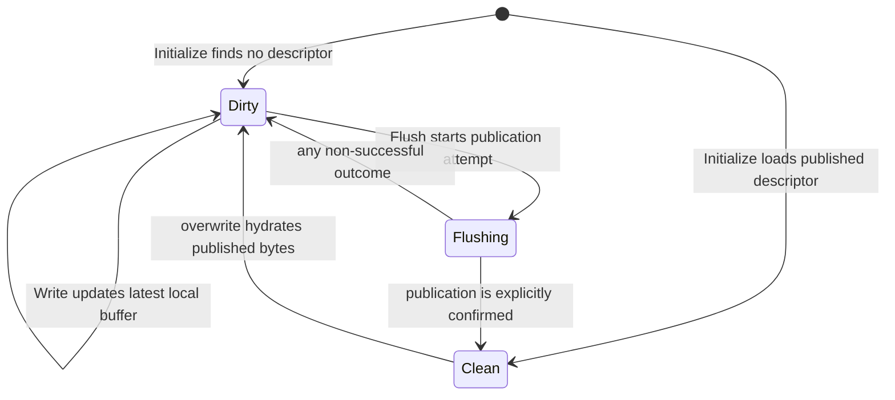

# Chunk Publication Contract

SwordFS stores each flushed chunk as an immutable object and publishes a
descriptor for that object through the metadata engine. The object and its
metadata are intentionally separate durability domains, so their ordering is
the publication protocol.

## Invariants

1. Local dirty bytes are visible only to handles sharing the local
   `FileReadWriter`. A new chunk has no persistent descriptor; a dirty rewrite
   leaves the old published descriptor authoritative until replacement commits.
2. `IDataEngine::Put()` returning `OK` means the complete immutable object is
   atomically readable under its revision-qualified key.
3. `IMetaEngine::CommitChunk()` is the reader-visibility barrier. A descriptor
   may be committed only after its object upload succeeds. Cleanup of an old
   or definitely rejected immutable revision is a separate best-effort
   maintenance action after a **known** publication outcome; cleanup
   completeness is not part of publication correctness.
4. A bounded successful `Chunk::Read()` returns exactly the requested bytes.
   It validates the bytes appended by `IDataEngine::Get()`; short data is an
   I/O error, never a successful chunk read.

The resulting publication order is:

```text
local write buffer
       |
       v
allocate unique revision
       |
       v
Put complete immutable object
       |
       v
CommitChunk descriptor with CAS
       |
       v
readers may resolve the object
```

No `Writing` or `Uploading` record is stored in metadata. Readers therefore
have only two persistent states to interpret: no descriptor (a hole) or a
descriptor for a completed object.

## Local state machine

These states belong to the local `Chunk`, not to persistent metadata:



| State | Retained state | Read/write behavior |
| --- | --- | --- |
| `kDirty` | Complete latest local buffer; last known published descriptor when rewriting | Reads local bytes; accepts writes |
| `kFlushing` | Same local buffer plus one transient immutable publication attempt | Synchronous transient state under the file operation lock |
| `kClean` | Confirmed authoritative descriptor; clean buffer retention is a separate cache policy | Reads authoritative data; overwrite becomes dirty |

`kFlushing` is not a durable lifecycle state. Every non-successful allocation,
upload, metadata commit, or reconciliation result returns the chunk to
`kDirty`, preserving the complete latest local buffer as writable and
retryable. An empty dirty buffer does not need publication. Hydration failure
leaves the chunk clean with its previous descriptor.

Publication-attempt state is separate from chunk data state. A failed attempt
may retain a candidate revision and CAS expectation for reconciliation, but a
later write supersedes that attempt's payload. Changed bytes must never be
published under the old immutable revision. If the previous metadata result
was ambiguous, retry first reconciles that candidate against authoritative
metadata and then publishes the newest complete local buffer from the current
authoritative descriptor.

## Persistence acknowledgement

An ordinary successful `write(2)` only copies bytes into the local `WriteBuf`.
It does not acknowledge persistence. The implemented persistence boundary is a
successful flush/fsync/final-close flush: each relevant dirty chunk has a
successful object `Put` and a known-success `CommitChunk` result. `O_SYNC` and
`O_DSYNC` write-through are not currently implemented.

This is an application-level ordering contract between SwordFS and its
external engines, not an extra storage barrier. Redis/object-store
acknowledgements are only as durable as those services are configured to be.
Pending-delete registration and physical garbage collection are outside this
acknowledgement.

## Flush and retry steps

`FileReadWriter` holds its exclusive operation lock while flushing a snapshot
of flushable chunks. Each chunk progresses independently; the file-level flush
tries the remaining chunks after a failure and returns its first error.

1. Transition the nonempty chunk from `kDirty` to transient `kFlushing`.
2. Reconcile any retained failed publication attempt against authoritative
   metadata before retrying it. This applies even when the previous attempt
   failed during `Put`: another metadata mutation may have changed the CAS base
   before the caller retries, and blindly reusing the old expectation would
   cause another avoidable rejection. If the candidate replacement is already
   authoritative, replay `CommitChunk` to confirm or repair transaction side
   effects without another object `Put`. If the local buffer is unchanged,
   that confirmation completes the publication. If the buffer changed, use
   the confirmed descriptor only as the new authoritative base and publish the
   newer local data with a fresh revision. If metadata differs from the old
   CAS expectation, the expectation is stale; under the supported
   single-active-mount contract the latest local buffer remains valid and
   rebases on the current descriptor. This reconciliation round trip exists
   only on retry/failure paths; a normal first-attempt successful flush does
   not pay it.
3. Allocate a fresh revision whenever there is no reusable candidate for the
   exact current payload.
4. Upload the complete local buffer under the revision-qualified object key.
5. CAS-publish the replacement using the current authoritative descriptor, or
   absence for a new chunk, as this attempt's expectation.
6. Only known publication success, or reconciliation that proves the exact
   candidate authoritative, transitions `kFlushing` to `kClean`. Successful
   publication retains the descriptor and clears the dirty publication state.
7. Any non-successful result returns `kFlushing` to `kDirty` and returns the
   error to the caller. The latest local bytes stay writable and retryable.

Once metadata has **definitely rejected** an uploaded revision, that revision
is terminal for the local `Chunk`: it is relinquished and a later retry
allocates a fresh revision. Cleanup registration is best effort, but if it did
succeed the background Reclaimer may already be eligible to delete that key;
reusing the revision would therefore violate immutable-key safety.

The same fresh-revision rule applies when a write or truncate changes the
payload after a failed attempt. Even a failed `Put()` can have an ambiguous
backend outcome, so changed bytes are never written under that old key.

`CommitChunk` is the visibility boundary. Cleanup registration/deletion failure
after successful publication does not revert that publication; at worst the
obsolete immutable object leaks. Local runtime state provides ambiguous-outcome
retry information only while the process retains the chunk.

## Failure and crash windows

| Failure point | Persistent result | Reader-visible result |
| --- | --- | --- |
| Before/during failed `Put` | No object is guaranteed; no metadata commit is attempted; the exact candidate may be retried only while its payload is unchanged | The local chunk returns to `kDirty`; no new descriptor is visible |
| After successful `Put`, before a known `CommitChunk` result | A complete object may be live or unreachable; a crash can leave garbage | Only an actually committed descriptor is visible; the local chunk stays dirty/retryable |
| `CommitChunk` returns a definite conflict / missing expected descriptor | That candidate revision is terminal and may be registered for cleanup; registration failure may leak it | The current descriptor remains authoritative for that failed attempt; a later retry may rebase and publish the latest local data with a fresh revision |
| `CommitChunk` result is ambiguous | Retry resolves the authoritative descriptor and replays a matching commit when needed to repair side effects | A matching candidate can be confirmed without another `Put`; otherwise the latest local buffer remains dirty and rebases on current authoritative state |
| After successful rewrite `CommitChunk` | Replacement is authoritative; superseded revision is best-effort registered for cleanup | The replacement chunk is readable |

The object-only crash windows are accepted under the current product contract:
they may leak storage but do not weaken the visibility invariant because
authoritative metadata never points to an object whose `Put` was not known to
have succeeded. A future inventory/sweeper may reclaim such residue without
changing this publication protocol.

A separate metadata mutation such as truncate/setattr can also return an error
after changing the authoritative chunk descriptor. In that case the local dirty
buffer remains complete and writable. A subsequent flush may first receive a
definite CAS rejection because its cached published descriptor is stale; that
failed attempt remains dirty, and the next retry reconciles the current
authoritative descriptor and republishes the latest complete local buffer with
a fresh revision. The failed metadata call is never silently converted to
success.

## Cleanup authority

`pending_deletes` stores maintenance candidates, not permission to delete.
`Reclaimer` always reads current authoritative chunk metadata before physical
deletion. If the same immutable key is still live, it skips that candidate.
This rule prevents stale maintenance state from deleting an object that is
currently authoritative; queue membership alone never grants delete authority.

## Why there is no post-upload `HEAD`

The data engine's successful `Put()` result is the completion contract. S3
single-key PUTs are atomic and strongly read-after-write consistent; another
`HEAD` would add a storage round trip without strengthening atomicity. Backends
that cannot provide this contract must not return `OK` from `Put()` until they
have established equivalent semantics.

Read-side exact-length validation remains mandatory. It detects a backend that
violates the contract, external object corruption/truncation, and stale or
malformed metadata without exposing unwritten buffer capacity to callers.
