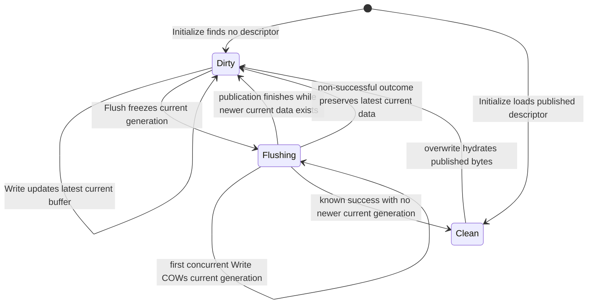

# Chunk Publication Contract

## Volume-fixed chunk type

The formatted volume records one stable `ChunkType` enum value.
Human-readable names such as `cow` are
accepted only at the CLI/configuration boundary and are converted there to the
typed value. Mount composes one mechanism implementation from the persisted enum;
runtime mechanism selection and private-index namespacing do not carry or
compare arbitrary mechanism strings. There is no per-file or per-chunk
mechanism tag and no live switching. Until the chunk-slice implementation is
activated by #270–#275, the existing immutable COW path is the only
selectable implementation. Logical chunk indexes are 64-bit values in the
common descriptor and in COW cleanup/reclaim payloads. SwordFS is
still beta, so current metadata is interpreted only by the current code and no
historical COW layout number is carried through a VFS-visible
chunk-type selection API. Known but unimplemented enum values such as
`chunk_slice` and `redis_cache` are rejected by mount/runtime composition.

The source layout mirrors that ownership boundary: common chunk contracts and
worker/factory orchestration live under `src/chunk/` (with common internals in
`src/chunk/internal/`), while COW-specific runtime, object-key, cleanup, and
private bridge implementation live under `src/chunk/cow/` and
`swordfs::chunk::cow`. A later slice implementation should use a peer mechanism
directory/namespace instead of mixing its private implementation into the
common chunk root.

Directory entries, inodes, and the file-to-logical-chunk head are shared. A
logical chunk's file offset is derived from its fixed-layout identity as
`chunk_index * chunk_size`; `start_offset` is not persisted in the common
record. `ChunkIndex` is a 64-bit unsigned logical coordinate. On the current
Linux target, the supported regular-file address space is the non-negative
range representable by `off_t`, through `2^63 - 1`; internal unsigned inode
fields do not extend that external contract. The 64-bit coordinate therefore
losslessly covers every logical chunk reachable by any supported chunk size,
including the minimum 4 KiB configuration.

File-offset mapping is checked before a chunk is opened: negative
offsets and a zero chunk size are invalid, the logical index is derived without
narrowing, and the derived chunk start must remain within the supported
`off_t` address space. Non-empty writes also validate their complete logical
range before mutating local chunk/cache state, so a write whose end would
exceed `off_t` max cannot partially update the file. During the staged #312
refactor, the common head still temporarily
carries logical size and a publication revision because existing publication,
truncate, and cleanup code consumes them. Those fields are transitional rather
than part of the target common contract and will be removed only after the
corresponding mechanism-private state becomes authoritative. The selected
mechanism owns the concrete `Chunk`, its internal index schema and operations,
the translation from private index state to physical data, and cleanup
validation/deletion.

Mechanism-owned metadata is exposed to chunk code through the mount-scoped
`ChunkMetadata` hierarchy, not through Redis-shaped hash/field/value strings
and not through a FileMetadata transaction. The common `ChunkMetadata`
contract is intentionally narrow: it identifies the selected `ChunkType` and
allocates fresh mechanism-neutral `ChunkID` values. Each mechanism adds its
own typed state API beside the records it owns. `cow` exposes
`COWChunkMetadata`, whose staged target state is
`ChunkID -> COWChunkHead{revision,size}` together with per-ChunkID revision
allocation, full-head CAS, semantic boundary clamp, and conditional erase.
`chunk_slice` adds its distinct typed
metadata root/state in #270. Unsupported mechanisms do not receive a generic
fallback ChunkMetadata implementation. Those APIs may have different record
shapes and mutation operations; a common revision or raw key/value API is not
required.

`ChunkID` answers which mechanism-owned chunk-state instance is attached to a
logical file position. It is a strong numeric identity, volume-scoped, stable
for one attached materialization lifetime, and never reused after detach. Its
numeric representation may be used for stable persistence/key encoding and
diagnostics but carries no mechanism semantics. Value zero is invalid;
allocated values are in `1..INT64_MAX` so Memory and Redis share one portable
representation. Ordinary COW rewrites and retained-boundary truncates do not
allocate a new ChunkID. A later rematerialization after detach receives a fresh
ID. This identity is distinct from `ChunkIndex` (where in the file) and from
the COW-private revision (which immutable object version backs the current COW
head).

ChunkID allocation is owned by ChunkMetadata and is independent of FileMetadata
transactions. Memory uses ChunkMetadata-owned synchronization and state rather
than the `MemMetaStore::Transact()` lock/commit lifecycle. Redis uses a
standalone volume-scoped counter through its backend executor rather than
joining `RedisMetaTxn` / `MULTI/EXEC` for correctness. Allocation may leave
gaps, exhaustion fails closed, and a Redis increment whose acknowledgement is
ambiguous returns `OutcomeUnknown`; callers obtain a fresh ID on a later
attempt rather than reconstructing or reusing the uncertain allocation.

`COWChunkRevision` is scoped to one `ChunkID` rather than to the volume. Each
ChunkID has an independent monotonic sequence in `1..INT64_MAX`; zero is
invalid, gaps are allowed after failed or ambiguous allocation, and an
allocated revision is never intentionally reused. Different ChunkIDs may use
the same revision number. The typed immutable object identity is therefore
`(ChunkID, COWChunkRevision)`, and COW object-key derivation can be performed
without an inode or logical chunk index. The legacy
`(InodeID, ChunkIndex, ChunkRevision)` object key remains the production data
path until #317 performs the authority/identity cutover.

`COWChunkHead{revision,size}` is the complete typed state for one ChunkID.
Both fields participate in equality and compare-and-swap. Ordinary rewrite
publishes a newer revision under the same ChunkID. Boundary truncate is a
specialized full-head CAS that preserves the revision and may only reduce the
visible `size`; this makes `{R,S_old}` conflict with a stale writer after a
successful `{R,S_new}` clamp even though both heads reference the same
immutable object. Conditional erase likewise requires the complete expected
head. These operations are mechanism-owned and do not join a FileMetadata
transaction.

### FileMetadata size planning and COW boundary sanitation

#318 stages the final size-change contract without making the typed model
production authority yet. The FileMetadata-facing planner operates only on a
consistent mechanism-neutral snapshot:

    EOF
    ChunkIndex -> ChunkID

and returns:

- the target EOF;
- the observed old EOF plus the old interior-boundary mapping state needed as
  a later publication precondition;
- one retained mapped boundary, when mechanism sanitation is required,
  expressed only as (ChunkIndex, ChunkID, visible_prefix);
- whole detached ChunkIDs on shrink for best-effort cleanup handoff.

The planner deliberately contains no COW revision, COW head, object key, or
backend-specific state. An interior EOF whose ChunkIndex has no mapping is
recorded as a hole. An EOF exactly on a chunk boundary has no retained
boundary at all.

The boundary/whole-detach arithmetic itself is shared with the legacy
authority path through a smaller ChunkSizeLayout classification containing
only the interior boundary (ChunkIndex, visible_prefix) and the first wholly
detached ChunkIndex. Memory and Redis legacy truncate consume that layout
instead of independently deriving offsets from SwordFsChunk; the final
FileMetadata planner applies the same layout to ChunkIndex -> ChunkID mappings.
This transitional reuse does not invent ChunkIDs for legacy descriptors and
does not make staged COW private heads authoritative.

For shrink S -> T, FileMetadata's final atomic operation will publish the new
EOF/attrs and detach every mapping wholly beyond T. If T falls inside a mapped
chunk, that mapping remains attached and the plan carries its ChunkID and
visible prefix for the selected mechanism to clamp after FileMetadata has made
the removed range unreachable. Shrink-to-zero therefore detaches every
mapping and has no retained boundary. Detached ChunkIDs are never reattached;
later materialization allocates fresh IDs.

For grow S -> T, the planner never scans detached mechanism state. Only an
attached ChunkID containing the old interior EOF can contain a hidden tail
that matters. That boundary is sanitized to the old visible prefix before
FileMetadata publishes the larger EOF. FileMetadata then revalidates the
planner's old-state precondition so sanitation cannot race with an unrelated
EOF or boundary-mapping change. If publication loses that race, the sanitation
is left in place because it only discarded bytes that were already hidden
beyond the authoritative old EOF.

COW implements the retained-boundary intent as a revalidation loop over the
typed COWChunkMetadata API:

    read current head
      |
      +-- head.size <= visible_prefix --> already safe
      |
      +-- head.size > visible_prefix
             |
             v
     full-head CAS {R,S} -> {R,visible_prefix}
             |
             +-- success --> safe
             +-- CAS conflict --> re-read the current head and retry from it
             +-- OutcomeUnknown --> re-read/reconcile authoritative head state

The loop never blindly retries a stale expected head. A concurrent ordinary
COW rewrite may advance the revision; sanitation then clamps the newly observed
revision. An ambiguous CAS is treated the same way at the orchestration layer:
the sanitizer first re-reads the authoritative head, then either observes that
the clamp already took effect or retries from the newly observed full head.
If the COW head disappears, FileMetadata attachment is revalidated:
the same ChunkID still being attached is a metadata inconsistency and fails
closed, while a detached/replaced mapping means the old ChunkID is no longer
authoritative and the sanitation attempt stops.

Through #318, this planning/sanitation API is staged and directly tested but
is not dual-written with live legacy state. Existing SwordFsChunk truncate
behavior remains production authority until #317. In particular,
ChunkMetadataBridge::Truncate() is retired here rather than becoming a second
cross-domain coordination mechanism. Legacy truncate may leave
mechanism-private residue for independent cleanup, but public descriptor
removal/clamp continues to determine visibility until the coherent #317
authority cutover.

Memory stores the typed COW head map and per-ChunkID revision counters behind
its own `FiberMutex`, independent of `MemMetaStore::Transact()`. Redis stores
each ChunkID head and revision counter under COW-private per-ID keys and uses
its own backend executor/optimistic transaction for head CAS/erase. Per-ID
keys keep unrelated ChunkIDs out of one Redis WATCH conflict domain. Redis
codec and key construction remain private to the Redis COW adapter.

The old `IMechanismPrivateTxn`, `MechanismPrivateTxnContext`, and
`IChunkIndexTxn::PrivateMetadata()` cross-domain transaction seam does not
exist in the target model. The transitional `IChunkIndexReader` /
`IChunkIndexTxn` raw read/scan/put/erase surface remains only for the existing
`ChunkMetadataBridge` callbacks while common `SwordFsChunk` is still
production authority. It is legacy bridge plumbing, not a typed ChunkMetadata
API, and new mechanism metadata must not use or extend it.

The #392 boundary does not define a universal mechanism record schema and does
not change read or publication authority. The common `SwordFsChunk` record,
legacy `AllocateChunkRevision()`, `ChunkPublishIntent`, `ChunkView`, and the
current COW publication/truncate/reclaim behavior remain authoritative
until the later #312 stages replace their consumers. Each typed mechanism
metadata implementation owns the consistency semantics of its own operations
inside its independent domain.

`ChunkMetadataBridge` is not a ChunkMetadata capability and does not retain
the mount's `ChunkMetadataPtr`. `cow::COWChunkMetadataBridge` is a
stateless transitional adapter for the remaining legacy/common-authority
transaction callbacks only. `VolumeImpl` owns and validates the private
metadata capability at mount composition. `ChunkFactory` narrows that
mount-scoped capability to `COWChunkMetadata` and injects it directly into each
`COWChunk` rather than through the bridge. During #316 the runtime retains this
dependency for the later authority cutover but does not read, publish, clamp,
or dual-write live state through it: common `SwordFsChunk` remains the only
production authority until #317.
#318/#319/#317 retire the bridge callbacks in stages and #320 removes the
remaining surface.

A concrete `Chunk` supplies an opaque `ChunkPublishIntent` after making its new
data durable. `CommitChunk` passes those bytes unchanged to the transitional
`ChunkMetadataBridge` while publishing the shared head. The bridge also uses
that intent to freeze cleanup for a definitely rejected upload, which may never
have appeared in the live private index. Reads use `LoadChunkView`: the
metadata backend reads the public head and asks the bridge to copy its private
snapshot in one Memory lock or validated Redis WATCH/EXEC read transaction.
The concrete chunk interprets the snapshot after that transaction;
object-store I/O does not hold a metadata transaction open.

Reclaim and pending-delete records carry opaque mechanism-private payloads.
They are maintenance envelopes, not reachability authority. The common metadata
engine may persist their envelope and queue identity without decoding physical
references, but correctness does not require a cleanup record to survive after
the FileMetadata point of no return. Losing such work may leak private metadata
or immutable objects; it must never make detached state reachable again.

Private `ChunkGcWorker` is mechanism-neutral. It owns queue visitation,
scheduling, retry, invocation, and generic acknowledgement only. A selected
chunk mechanism provides an internal cleanup participant that owns payload
decode/validation, authoritative reachability revalidation, physical-object key
derivation, and destructive object deletion. The worker does not include COW
code, compare COW revisions, derive COW keys, or switch on COW deletion policy.
Generic `BufCodec` schema and exact `RecordType` checks still frame persisted
envelopes; malformed mechanism payloads fail closed and remain queued. Typed COW
reclaim decoding checks that its declared detached-identity count fits the
encoded payload before reserving the corresponding in-memory list.

Cleanup has two distinct reachability levels in the final authority model:

```text
FileMetadata reachability:
    ChunkID is live while a live/revivable inode has an authoritative
    ChunkIndex -> ChunkID mapping to it

COW private reachability:
    within a live ChunkID, COWChunkHead.revision is the live immutable revision
```

`COWChunkHead.size` participates in full-head CAS but not immutable-object
identity. Typed COW cleanup therefore identifies an immutable object by
`ChunkID + COWChunkRevision`. A rewrite may retire an old revision while the
ChunkID remains attached. Whole-chunk truncate/reclaim cleanup operates on a
detached ChunkID and may remove the current COW head/object only after
FileMetadata revalidation confirms that the ChunkID is no longer reachable.
A candidate whose revision still equals the live COW head remains live even if
the head size changed.

#319 stages this private cleanup contract without changing production
FileMetadata authority. Legacy `SwordFsChunk` cleanup payloads and live common
descriptor reachability remain authoritative until #317. Typed
`ChunkID + COWChunkRevision` cleanup payloads and the mechanism-owned cleanup
participant may exist and be directly tested, but production does not dual-write
legacy and typed cleanup state. #317 switches FileMetadata mappings, COW private
authority, object identity, and cleanup reachability together.

For new orphan candidates, `OrphanReclaimer` enters `PrepareReclaim` under the
open-handle fence. The FileMetadata transition, not `ReclaimWork`, is the
reclaim correctness boundary:

```text
revalidate nlink == 0
        |
        v
make the inode non-revivable
        |
        v
detach all authoritative ChunkIndex -> ChunkID mappings
        |  correctness point of no return
        v
best-effort cleanup handoff / mechanism cleanup / object deletion
```

Memory expresses the non-revivability and detach transition atomically. Redis
uses the inode key itself as the fence: `Link` and reclaim WATCH the same inode
key. Inside `MULTI/EXEC`, critical destructive commands are queued in
non-revivability-before-detach order: delete the inode first, then delete its
mapping state. Auxiliary orphan markers and optional cleanup envelopes are not
part of the reachability fence and cannot weaken that ordering.

Redis `OutcomeUnknown` is reconciled from authoritative FileMetadata state
rather than by replaying stale cleanup work. If the inode still exists with
`nlink == 0`, reclaim retries from a fresh inode/mapping snapshot. If it exists
with `nlink > 0`, revival won and destructive cleanup stops. If the inode is
absent, logical reclaim is complete even when the detached-ID/object list was
lost. Any mapping record surviving under an absent inode is unreachable residue,
not live ChunkID reachability. `ChunkGcWorker` does not own the VFS open-handle
fence and never turns queue membership into delete permission.

## #317 final authority cutover — normative implementation contract

This section is the authoritative #317 design baseline. It supersedes the
pre-#394 common `SwordFsChunk` lifecycle-marker/private-head design notes in
#312 and the *legacy implementation* sections below. The permanent attachment
root is FileMetadata `ChunkIndex -> ChunkID`, not a presence-only common marker;
a private COW head without that attachment is unreachable residue, **not**
published file data. A published attachment with no COW head is an inconsistency,
**not** a hole. The mechanism-specific publication object/bridge descriptions
from the earlier staged design are not final public architecture.

### Domain boundaries and proposed semantic operations

`IMetaEngine` remains the VFS-facing facade. It sequences FileMetadata-only
mutations and independently invokes the injected typed `COWChunkMetadata`
capability; it does not open a FileMetadata transaction while holding a private
ChunkMetadata transaction, or vice versa. Exact C++ names are implementation
choices, but the FileMetadata backend must expose the following **semantics**
without carrying COW revisions/head sizes:

| FileMetadata operation | Atomic result / conflict condition |
| --- | --- |
| `ReadFileChunkSnapshot(ino,index)` | One consistent inode EOF/attributes + optional attached ChunkID at the requested index. A missing inode is an error; missing mapping *within* EOF is a hole. No full file-map scan on normal reads. |
| `ReadFileMappingSnapshot(ino)` | One consistent EOF/attrs + complete typed `ChunkIndex -> ChunkID` mapping snapshot for size planning, with duplicate/out-of-range mapping detection. |
| `AttachPrepared(ino,index,new_id,visible_end,expected)` | In one FileMetadata transaction: require live regular inode, mapping still absent, satisfy the relevant EOF/boundary preconditions, attach *fresh* ChunkID, and publish needed EOF/mtime/ctime together. A competing attachment is a conflict; never overwrite it. |
| `FinalizeAttachedWrite(ino,index,id,visible_end,expected)` | Require mapping still equals the stable ChunkID and applicable observed FileMetadata EOF/boundary state is current; update requested inode EOF by max/attrs atomically. Never replace the ChunkID or persist COW revision/size. |
| `CommitShrink(ino,plan,attrs)` | Validate the *entire* size/SetAttr request before destructive changes. In one FileMetadata transaction replan/revalidate the current snapshot, publish the smaller EOF/attrs and detach **all** whole mappings beyond EOF; return detached IDs and retained boundary as ephemeral output. |
| `CommitGrow(ino,plan,attrs)` | After boundary sanitation, atomically require the plan's exact observed old EOF and old boundary mapping/hole state, then publish enlarged EOF/attrs. A lost precondition is a conflict, not a successful grow. |
| `ProbeAttachment(ino,index)` | Return the current FileMetadata mapping for mechanism cleanup and boundary missing-head revalidation. A disappeared/non-revivable inode does not make old mappings live. |

The snapshot and mutation paths are both mechanism-neutral and preserve full
64-bit `ChunkIndex` and typed `ChunkID` validation. For Mem, keep the map
and inode under the existing FileMetadata transaction lock, separate from the
`MemCOWChunkMetadata` lock. For Redis, keep canonical per-inode mapping hash
fields plus inode inside the FileMetadata WATCH/EXEC domain; use one
FileMetadata-only optimistic transaction for each atomic operation. Re-read
inode/mapping on WATCH conflicts. Backend codec/key details stay inside
Mem/Redis adapters. Do not implement the final contract by projecting a
`SwordFsChunk` containing stale revision/size.

There is **no file-wide persistent content epoch, distributed lock, publication
intent or cross-domain transaction**. `FileSizePrecondition` contains the
observed old EOF and interior-boundary mapping/hole identity, not a COW
revision. Inode attribute-only updates can race as usual; a transaction must
read fresh inode state and apply only the requested fields, without restoring
unrelated attributes from an older snapshot. `SetAttr` validates all requested
fields/policy before the first destructive size operation.

### Publication and error ownership

**First attachment / rematerialization**:

1. Observe `FileMetadata(ino,index)` as unmapped and capture the relevant
   file-visible preconditions.
2. Allocate fresh volume-scoped `ChunkID`; allocate a fresh COW revision
   scoped to it; upload the complete immutable `(ChunkID,revision)` object.
3. Initialize `COWChunkMetadata[ChunkID]` with full head
   `{revision,size}` via typed CAS from absent. An ambiguous CAS is reconciled
   by reading the head; do not assume failure or reuse an uncertain ID.
4. Only **after** the mechanism state is known prepared, conditionally publish
   the mapping and any EOF/attrs together using `AttachPrepared`.
5. A competing mapping winner or failed FileMetadata finalization leaves the
   unused ID/head/object unreachable. Never reattach/reuse that ID; cleanup
   is best effort and must not delete a live current revision.

**Rewrite of an attached ChunkID**:

1. Validate attachment identity and read the *current* full typed head.
2. For each outer Flush attempt allocate a **fresh** per-ID revision, upload
   immutable data, and CAS exactly
   `{expected_revision,expected_size} -> {new_revision,new_size}`.
3. Known head-CAS success is the mechanism's publication point. Perform
   FileMetadata inode/EOF side effects *afterward*, conditional on the stable
   ChunkID still being attached; before those side effects, re-read the
   exact candidate typed head. Rewrites never replace the mapping.
4. Known rejection may register a definitely unused object for best-effort
   cleanup. `OutcomeUnknown` is **indeterminate**: refresh head/attachment,
   never delete the candidate based on that error, and a later *outer* Flush
   uploads under a new revision. If head CAS succeeded but FileMetadata
   finalization failed, that revision may already be authoritative; keep it.
5. A lost attachment or new ChunkID rejects the old session; a stale session
   must not attach its previous ChunkID, or silently copy its formerly
   hydrated full-chunk image into a newly attached ID.

FileMetadata finalization is idempotently retriable *within the same
in-process candidate* when only an unrelated EOF/attribute mutation moved
the FileMetadata snapshot: re-read current FileMetadata and verify the
same ChunkID is attached **and** the exact candidate typed head is still
current, then retry the FileMetadata max-EOF/attrs phase with new
preconditions. This does **not** authorize another COW head CAS using the
old revision. Different chunks in a parallel Flush may race to advance EOF;
an observed EOF precondition conflict is not by itself a failed chunk
publication if this fresh revalidation succeeds. If either candidate head
or mapping changed, stop that finalization and follow the stale-session
conflict/retry rule.

FileMetadata finalization publishes EOF/attrs using its own optimistic
preconditions, **not** as part of COW head CAS. A COW head may contain data
beyond current EOF after a failed finalization; that suffix is hidden and
subsequent *explicit grow* must sanitize the retained boundary before
exposure. Such an error cannot classify the already-successful private CAS
as a definitely rejected object. If an already attached rewrite requires no
EOF growth, the head CAS remains the data-publication point; timestamp failure
does not roll it back.

Multi-chunk Flush remains bounded parallel per-chunk publication, with
independent results and per-operation FileMetadata conditional finalization;
it does **not** acquire a file-wide cross-domain transaction. Each attach
publishes its own mapping and applicable EOF in one FileMetadata transition.
Partial Flush failure preserves retryable local generations and reports error;
it does not claim all-or-nothing success across chunks. There is no public
`SwordFsChunk` revision CAS or two-authority shadow write.

### Size transitions / crash and ambiguous outcomes

**Shrink**: under the mount-local exclusive inode size/operation barrier,
validate the requested SetAttr fields, then atomically commit FileMetadata
EOF/attrs + whole-chunk detach. After the commit, clamp the retained *attached*
boundary COW head via #318's full-head CAS/revalidation loop. A failed/crashed
clamp may leave a tail **hidden by EOF**; this is not permission for a future
grow to expose it. Detached IDs and physical cleanup targets may leak.
Do not restore detached mappings. If the boundary's mapping still exists but
its head is absent, fail closed as an inconsistency, while still reconciling
the already committed FileMetadata EOF into the local session/cache.

**Explicit grow**: while holding the same local exclusive barrier, observe
FileMetadata old EOF+boundary ID, sanitize **only** that still-attached
interior boundary to its previously visible prefix (no exact-boundary or hole
sanitization), and then `CommitGrow` with the exact old FileMetadata
precondition. Do not scan or reattach detached IDs. If the final grow loses
the precondition, report/retry from a fresh snapshot as appropriate; do not
restore removed hidden bytes. A sanitation CAS conflict or ambiguous result
re-reads the head and reconciles as #318 specifies. Revalidation of
FileMetadata before a destructive clamp remains necessary when the boundary
is concurrently replaced/disappears, but an independent FileMetadata read and
private CAS must **not** be described as a globally atomic guard.

**EOF-extending writes** are *not* explicit file grow: the writer's newly
uploaded bytes at its chosen offsets must survive publication. In the attached
old-EOF boundary, hydrate the current **visible** prefix (not any hidden
head suffix) before applying local writes; do not sanitize away the writer's
new bytes as a separate explicit-grow step. Its COW head CAS and conditional
FileMetadata EOF finalization are the publication sequence described above.
When a concurrent size transition invalidates its FileMetadata precondition,
the stale candidate cannot silently cause EOF growth; retry the complete
logical write/flush attempt with fresh attachment/head and a fresh revision,
or report a conflict while preserving local dirty data.

**Ambiguity**:

- private CAS unknown: re-read that ChunkID's head; if the candidate is
  current, treat it as potentially authoritative, not rejected; refresh for
  any next attempt;
- FileMetadata attach/finalization unknown: re-read inode EOF and mapping
  under FileMetadata authority; if a first-attach candidate is *currently*
  mapped to that ID, reconcile its publication, and if a competing ID is
  mapped, report conflict. If mapping is absent, the uncertain ID may have
  been attached then detached: do **not** try to attach that ID again;
  begin a new materialization with a fresh ID. An attached-rewrite
  candidate may retry *only* its FileMetadata side effects after confirming
  that mapping and the exact COW head still match; do not blindly replay
  an uncertain FileMetadata write from stale preconditions;
- FileMetadata shrink/grow unknown: re-read EOF *and mapping snapshot*, not
  merely a status flag. Apply local EOF/cache invalidation to the observed
  authoritative state **even if the syscall reports an error**; this prevents
  stale dirty sessions republishing after a shrink that actually committed;
- cleanup registration/physical deletion errors may leak and never revert
  a known successful logical publication or detach.

### Runtime session identity and cache

The runtime identity is `(ino,ChunkIndex,attached ChunkID)`. A session
opened on a hole is *unattached* until it wins first materialization; no
identity is permanently assigned merely by a speculative write. Clean
sessions contain the typed COW head as a refreshable snapshot, never as a
FileMetadata copy of revision/size.

`ChunkFactory::Open` resolves a FileMetadata mapping (and visible EOF)
instead of consulting legacy `FindChunk/SwordFsChunk`. For a mapped entry,
it resolves the typed head; missing head is an error. For no mapping, a read
gets a hole and a write may create an unattached dirty session. Hydration
reads **only** the published visible head prefix and fills holes with zeros;
exact object-read length and bounds must be verified.

`FileChunkManager` may retain the current index-keyed container for efficient
same-mount access, but **not** interpret the index as immutable chunk-session
identity. With the mount-local inode operation barrier held:

- regular cache hits may reuse a validated same-mount session without
  incurring a new FileMetadata network read for *each* read;
- local committed shrink detaches/evicts every whole chunk session beyond EOF
  and clamps/invalidates the boundary local generation **before releasing the
  exclusive barrier**; following rematerialization opens a new session with a
  fresh ID;
- local successful grow must refresh the boundary view so an old hidden
  head suffix cannot reappear as cached data;
- CAS/retry/attachment conflict refreshes FileMetadata mapping and typed head;
  if the index now identifies a different/absent ChunkID, invalidate the old
  session and fail closed or build a **new** session from the current mapping;
- a stale dirty snapshot cannot silently migrate old hydrated bytes to a
  different ChunkID. Mount-local size changes discard/truncate affected local
  pending buffers consistently with POSIX size semantics; stale remote
  replacement is an explicit conflict/rebase decision, not implicit replay;
- drop/refresh failed ambiguous-size-operation cache state from authoritative
  FileMetadata even when the initiating operation returns an error.

The existing `FileReadWriter::operation_mutex_` already gives the same-mount
exclusive size-change versus shared write/read/flush coordination; retain
bounded parallel Flush for different chunks. Cache insertion or replacement
must be ordered under that operation barrier plus the manager's own map
mutex. Do not add an always-on per-read distributed transaction merely as
an accidental result of switching authority.

### Concurrency guarantee boundary

Mount-local size changes (truncate/size SetAttr/explicit grow) are serialized
against mount-local read/write/flush by the existing per-inode operation
barrier. Redis FileMetadata WATCH/EXEC detects **observed** inode/mapping
changes, and COW full-head CAS detects **observed** same-ID rewrites; a known
loss of either precondition is a conflict requiring refresh. Memory maintains
independent per-domain locks, not one hidden global transaction. Tests must
cover stale candidate and mapping replacements across the Redis phase
boundaries, as well as same-mount flush versus shrink and grow.

**Not guaranteed in #317:** full linearizability of arbitrary *cross-mount*
concurrent write versus shrink/grow, nor read-vs-remote-GC pinning. Without
a cross-domain atomic predicate, distributed per-inode exclusion/fencing, or a
durable sequencing protocol, `re-read head -> independent FileMetadata
commit` and `re-read EOF -> independent head clamp` both have TOCTOU
windows. For example, an external grow can finalize new visible data after
the shrink's FileMetadata read but before its later COW clamp. Those reads
and conditional commits alone cannot prove the later clamp is safe.

This limitation must be treated as an **explicit supported-concurrency
boundary**, not as an implemented multi-node write guarantee. Do not add a
content epoch, new distributed coordinator or cross-domain transaction merely
under #317. If strong cross-mount concurrent mutation is required for this
release, that requirement is a genuine **design gate** demanding a separate
fencing/serialization decision before claiming #317 is complete. The
accepted #312 non-goal of distributed read-vs-GC leases remains separate.

### Contract-first verification matrix for the later TDD phase

No production implementation or tests are introduced by this design-only
checkpoint. When implementation is approved, test:

1. Mem+Redis snapshots (EOF + mapping), full 64-bit keys, type/range errors;
   conditional attach winner/loser, atomic attachment+EOF/attrs.
2. First attach: prepared object/head before mapping, failure/ambiguous
   attach, no stale-ID reattachment, fresh-ID rematerialization.
3. Same-ID rewrite: full-head CAS, fresh revision per Flush, same-revision
   size-only clamp conflict, ambiguous CAS reconcile, later FileMetadata
   finalization failure never marks published object definitely garbage.
4. EOF-extending write into a retained boundary with hidden tail: intended
   new bytes survive, unwritten bytes zero, and a stale finalize cannot extend
   EOF; multi-chunk Flush preserves partial-success/retry semantics.
5. Shrink (0/exact/interior/hole) and grow (exact/hole/already-safe/hidden
   tail) with full detach+EOF atomicity and FileMetadata precondition
   failures; lost clamp/ambiguous outcome leaves hidden tail, not resurrection.
6. Redis WATCH loss and ambiguous FileMetadata commit: authoritative
   resnapshot, correct local cache invalidation even after error; no
   stale-ChunkID reattachment or live-head object deletion.
7. Same-mount concurrent read/write/flush/size SetAttr with cached sessions;
   invalidation on detach, fresh-ID rematerialization, dirty boundary cut,
   stale session versus new mapping.
8. Typed GC: revision-only physical liveness, detached ID reachability,
   reclaim non-revivability and loss-tolerant maintenance work, no legacy
   cleanup authority emitted after #317.
9. Remount/read and full FUSE/Redis/fstests regressions. Cross-mount
   write-vs-size linearizability is **not** asserted without the explicit
   distributed-fencing design gate described above.

The COW publication protocol below describes the transitional
`cow` implementation. Its object revision and key are private to that
implementation. The stable `Chunk` contract preserves local-write visibility, chunk-relative
offsets, exact bounded reads with hole reconstruction, successful-flush
acknowledgement, retryable failures, and generation isolation; it does not
require other mechanisms to hydrate or rewrite a complete chunk.

SwordFS stores each flushed chunk as an immutable object and publishes a
descriptor for that object through the metadata engine. The object and its
metadata are intentionally separate durability domains, so their ordering is
the publication protocol.

## Invariants

1. Local dirty bytes are visible only to handles sharing the local
   `FileReadWriter`. A new chunk has no persistent descriptor; a dirty rewrite
   leaves the old published descriptor authoritative until replacement commits.
2. `IDataEngine::Put()` returning `OK` means the complete immutable object is
   atomically readable under its revision-qualified key.
3. `IMetaEngine::CommitChunk()` is the reader-visibility barrier. A descriptor
   may be committed only after its object upload succeeds. Cleanup of an old
   or definitely rejected immutable revision is a separate best-effort
   maintenance action after a **known** publication outcome; cleanup
   completeness is not part of publication correctness.
4. A bounded successful `Chunk::Read()` returns exactly the requested bytes.
   It validates the bytes appended by `IDataEngine::Get()`; short data is an
   I/O error, never a successful chunk read.
5. A persisted chunk descriptor describes only the supported file address
   space. `index * chunk_size` and `start_offset + size` are checked without
   signed/unsigned wrap. An extent ending exactly at `off_t` max is valid; an
   extent beyond that boundary is invalid.

The resulting publication order is:

```text
local write buffer
       |
       v
allocate unique revision
       |
       v
Put complete immutable object
       |
       v
CommitChunk descriptor with CAS
       |
       v
readers may resolve the object
```

No `Writing` or `Uploading` record is stored in metadata. Readers therefore
have only two persistent states to interpret: no descriptor (a hole) or a
descriptor for a completed object.

## Local publication generations

Publication is owned per chunk rather than by a file-wide remote-I/O critical
section. A chunk has one complete **current** buffer. Starting a flush freezes
that buffer as the immutable **flushing generation** and then performs remote
publication without holding an inode-wide or chunk lock for the remote
latency.

If no write arrives during publication, no extra copy is needed. The first
write that arrives while `current == flushing` performs one whole-buffer copy
while holding the per-chunk lock, installs the copy as the new current
generation, and applies the new bytes there. Later writes during the same
publication modify that current generation directly. Thus one flushing
generation causes at most one copy, and only when write-during-flush occurs.

The initial design intentionally performs that copy under the per-chunk lock.
This accepts a bounded same-chunk memory-copy stall in exchange for a small,
explicit state machine; independent chunks of the same inode remain free to
make progress. Dirty-buffer representation and memory-amplification work may
later change this trade-off without changing the publication contract.

Reads always use the complete latest-local generation. There is no base-plus-
overlay merge contract: before COW they use the flushing/current buffer; after
COW they use the new complete current buffer.

For a clean chunk, a read keeps a shared per-chunk lock while reading the
published immutable object. This pins that local published revision until the
remote read completes: the exclusive clean-to-dirty transition cannot make the
old revision eligible for rewrite cleanup underneath an in-flight read. Shared
locking preserves concurrent reads of the same chunk; this is deliberately a
per-chunk lifetime boundary rather than an inode-wide remote-I/O lock.

The first overwrite of a clean chunk keeps the per-chunk exclusive lock while
hydrating the authoritative immutable object and installing the complete dirty
generation. This deliberately serializes same-chunk clean reads and first
overwrite hydration, avoids duplicate whole-chunk hydration, and pins the
source revision until the local generation is complete. The inode operation
lock remains shared, so unrelated chunks can hydrate and write independently;
only same-chunk work pays this remote-I/O critical section.

At most one remote publication generation is in flight per chunk. Independent
chunks publish concurrently in batches bounded by the configured storage worker
count. Metadata calls use their own executor and are independently bounded by
its worker count; a small metadata pool therefore does not unnecessarily
serialize the longer object uploads. A file-level flush barrier is serialized
against another flush barrier, so a newer generation of the same chunk cannot
begin remote publication before the older generation finishes. Consequently,
#199 adds at most one extra COW buffer for each chunk in the active publication
batch, approximately `storage-thread-count * chunk-size` beyond the
already-existing dirty buffers. The pre-existing total number of dirty chunks
is not made unbounded by a generation queue; mount-wide dirty-memory accounting
and backpressure for sparse workloads remains the separate #202 concern.

## Local state machine

These states belong to the local `Chunk`, not to persistent metadata:


```mermaid
stateDiagram-v2
    [*] --> Dirty: Initialize finds no descriptor
    [*] --> Clean: Initialize loads published descriptor
    Dirty --> Dirty: Write updates latest current buffer
    Dirty --> Flushing: Flush freezes current generation
    Flushing --> Flushing: first concurrent Write COWs current generation
    Flushing --> Dirty: publication finishes while newer current data exists
    Flushing --> Dirty: non-successful outcome preserves latest current data
    Flushing --> Clean: known success with no newer current generation
    Clean --> Dirty: overwrite hydrates published bytes
```

| State | Retained state | Read/write behavior |
| --- | --- | --- |
| `kDirty` | Complete latest local buffer; last known published descriptor when rewriting | Reads local bytes; accepts writes |
| `kFlushing` | One immutable flushing generation and optionally a newer complete current buffer | Remote publication proceeds without holding a file-wide remote-I/O lock; writes may COW once and continue on the newer generation |
| `kClean` | Confirmed authoritative descriptor; clean buffer retention is a separate cache policy | Reads authoritative data; overwrite becomes dirty |

`kFlushing` is not a durable lifecycle state. The immutable generation remains
stable for the entire remote attempt. If a newer current generation is created,
success of the older publication advances the authoritative baseline but leaves
the newer current generation dirty. A non-successful allocation, upload,
metadata commit, or reconciliation result likewise preserves the complete
latest current generation as writable and retryable. An empty dirty buffer
does not need publication. Hydration failure leaves the chunk clean with its
previous descriptor.

Publication retry state is separate from chunk data state. A failed attempt's
revision is never reused by a later Flush, even when the local payload has not
changed. The next retry first refreshes the authoritative chunk descriptor,
then allocates a new immutable revision and republishes the complete latest
local buffer from that CAS baseline. This deliberately trades exceptional-path
object I/O for a smaller correctness state machine: the client does not need to
remember whether an old candidate was uploaded, whether its payload is still
current, or whether that revision remains reusable.

## Persistence acknowledgement

An ordinary successful `write(2)` only copies bytes into the local `WriteBuf`.
It does not acknowledge persistence. The implemented persistence boundary is a
successful flush/fsync/final-close flush: each relevant dirty chunk has a
successful object `Put` and a known-success `CommitChunk` result. `O_SYNC` and
`O_DSYNC` write-through are not currently implemented.

This is an application-level ordering contract between SwordFS and its
external engines, not an extra storage barrier. Redis/object-store
acknowledgements are only as durable as those services are configured to be.
Pending-delete registration and physical garbage collection are outside this
acknowledgement.

## Flush and retry steps

`FileReadWriter` snapshots the chunks covered by the flush barrier, then allows
independent chunks to publish with bounded concurrency. The file-level lock is
reserved for genuinely file-wide coordination such as size/truncate barriers;
S3/object upload and Redis chunk publication do not hold it for their remote
latency. The flush still observes every chunk in its barrier even if another
chunk fails and returns the first error after draining the submitted work.

A file-level persistence barrier snapshots the currently flushable chunks after
entering the serialized `Flush()` operation. Every write that completed before
that snapshot is represented by a selected dirty chunk and is covered by the
barrier. A selected chunk freezes its current generation under the per-chunk
lock when publication starts; writes that race in before that freeze may be
included as an allowed strengthening of the barrier. A write that linearizes
after the freeze COWs into the next current generation and belongs to a later
barrier; it remains visible locally and must not let the older publication
clear transient live-size state.

1. Transition the nonempty chunk from `kDirty` to transient `kFlushing`.
2. If any earlier Flush attempt returned a non-success status, refresh the
   authoritative descriptor with `FindChunk` before retrying. An existing
   descriptor becomes the new cached CAS baseline; `NotFound` establishes an
   absent baseline; other lookup failures remain observable and leave the
   chunk dirty. This reconciliation round trip exists only on retry/failure
   paths; a normal first-attempt successful Flush does not pay it.
3. Allocate a fresh revision for every publication attempt. A revision from a
   failed or ambiguous attempt is abandoned and never retried. The metadata
   engine's volume-scoped monotonic allocator guarantees this new revision is
   newer than any authoritative revision observed during the refresh.
4. Upload the complete local buffer under the revision-qualified object key.
5. CAS-publish the replacement using the current authoritative descriptor, or
   absence for a new chunk, as this attempt's expectation.
6. A known-success `CommitChunk` advances the authoritative descriptor and
   clears retry-refresh state. If the flushing buffer is still the current
   buffer, the chunk becomes `kClean`; if COW created a newer current
   generation, that newer generation remains `kDirty` for a later barrier.
7. Any non-successful result returns `kFlushing` to `kDirty` and returns the
   error to the caller. The latest local bytes stay writable and retryable,
   and the next Flush refreshes its metadata baseline before allocating
   another fresh revision.

Every failed Flush marks the next retry for authoritative refresh, including a
revision-allocation failure where no candidate object exists yet. Whenever a
revision was allocated for a failed attempt, that revision is never reused.
This single rule covers definite metadata rejection, ambiguous metadata
errors, failed/ambiguous `Put()`, and payload changes without separate
candidate-reuse cases.

`CommitChunk` is the visibility boundary. Cleanup registration/deletion failure
after successful publication does not revert that publication; at worst the
obsolete immutable object leaks. A candidate abandoned after an ambiguous
failure may also leak if no safe cleanup record was established. Retry
correctness does not depend on reclaiming that object, and foreground code must
not delete an uncertain candidate without authoritative-state revalidation.

## Failure and crash windows

| Failure point | Persistent result | Reader-visible result |
| --- | --- | --- |
| Before/during failed `Put` | No object is guaranteed; no metadata commit is attempted; the candidate revision is abandoned | The local chunk returns to `kDirty`; the next Flush refreshes metadata and uses a new revision |
| After successful `Put`, before a known `CommitChunk` result | A complete object may be live or unreachable; a crash can leave garbage | Only an actually committed descriptor is visible; the local chunk stays dirty/retryable |
| `CommitChunk` returns a definite conflict / missing expected descriptor | That candidate revision is terminal and may be registered for cleanup; registration failure may leak it | A later retry refreshes the authoritative descriptor and publishes the latest local data with a fresh revision |
| `CommitChunk` result is ambiguous | The old candidate may or may not be authoritative; retry reads the current descriptor but never reuses the old revision | If the old candidate is authoritative it becomes only the CAS baseline for a newer revision; otherwise the observed descriptor/absence becomes that baseline |
| After successful rewrite `CommitChunk` | Replacement is authoritative; superseded revision is best-effort registered for cleanup | The replacement chunk is readable |

The object-only crash windows are accepted under the current product contract:
they may leak storage but do not weaken the visibility invariant because
authoritative metadata never points to an object whose `Put` was not known to
have succeeded. A future inventory/sweeper may reclaim such residue without
changing this publication protocol.

A separate metadata mutation such as truncate/setattr can also return an error
after changing the authoritative chunk descriptor. In that case the local dirty
buffer remains complete and writable. Any earlier failed Flush already marks
the next retry for authoritative refresh; if a first attempt instead discovers
the stale descriptor through a definite CAS rejection, that failure sets the
same retry-refresh state. The following Flush rebases on current metadata and
republishes the latest complete local buffer with a fresh revision. The failed
metadata call is never silently converted to success.

## Cleanup authority

`pending_deletes` stores maintenance candidates, not permission to delete.
Private chunk GC invokes the selected mechanism's cleanup participant, which
validates the mechanism-private payload and rechecks authoritative metadata
before physical deletion. For typed `cow`, rewrite cleanup compares only
`ChunkID + COWChunkRevision` with the current COW head; a same-revision head is
live regardless of size. Whole-ChunkID cleanup first verifies that FileMetadata
no longer reaches that ChunkID, then may delete the current private object/head.
Late private updates to a detached ChunkID remain unreachable residue because
FileMetadata never reattaches detached IDs.

During #319 the production COW participant also understands the legacy cleanup
payloads still emitted by common-authority publication/truncate/reclaim paths
and revalidates them against legacy descriptors. This is a staging adapter, not
dual-written authority. #317 removes that legacy reachability source when the
FileMetadata ChunkID mapping becomes authoritative.

`ReclaimWork`, when retained, improves maintenance continuity and retry but is
not the reclaim fence. Last-link reclaim establishes inode non-revivability
before destructive mapping detach. A crash after that point may permanently
lose cleanup work and leak objects; correctness is preserved because neither
the inode nor a detached ChunkID can be revived. Queue membership alone never
grants delete authority.

## Why there is no post-upload `HEAD`

The data engine's successful `Put()` result is the completion contract. S3
single-key PUTs are atomic and strongly read-after-write consistent; another
`HEAD` would add a storage round trip without strengthening atomicity. Backends
that cannot provide this contract must not return `OK` from `Put()` until they
have established equivalent semantics.

Read-side exact-length validation remains mandatory. It detects a backend that
violates the contract, external object corruption/truncation, and stale or
malformed metadata without exposing unwritten buffer capacity to callers.
