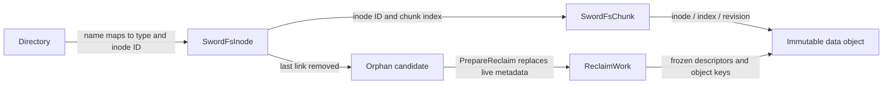
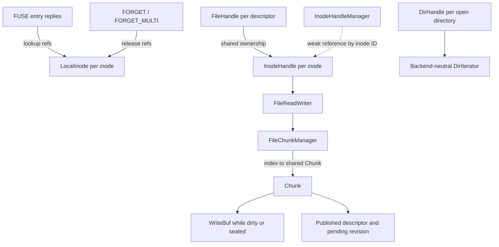

# Data structures and ownership

SwordFS separates authoritative metadata, immutable object bytes, and
per-mount runtime state. Redis persists metadata; Memory retains the same
logical records for the process lifetime, except for saved volume configuration.

## Logical records

| Structure | Essential content | Authority and lifetime |
| --- | --- | --- |
| `SwordFsVolume` | Volume identity, data-engine identity, bucket/location, region, chunk size | Defines how a mounted volume interprets its storage |
| Directory entry | Name, child inode ID, child type | Namespace mapping; multiple entries may name one regular-file inode |
| `SwordFsInode` | ID, attributes including size and `nlink`, parent ID, symlink target | Canonical inode attributes; removing a name need not remove the inode |
| `SwordFsChunk` | Index, start offset, revision, size | Currently published bytes for one logical chunk |
| Orphan candidate | Inode ID and cleanup marker | Last-link removal recorded while the live inode still exists |
| `ReclaimWork` | Inode ID and vector of `ReclaimChunk` | Replaces live inode/chunk metadata atomically at reclaim preparation |
| `ReclaimChunk` | Frozen descriptor and exact object key | Deletion target independent of mutable live state |

A directory entry does not duplicate full inode attributes. `parent_ino` is
not a reverse index of every hard link: namespace lookup follows directory
name mappings. `nlink` counts namespace links, separately from open references.

For chunk size `C`, file offset `x` maps to index `x / C` and offset `x % C`
within the chunk. Descriptor size may be smaller than `C`. Missing descriptors
and gaps after chunk data represent holes, filled with zeroes by the read path.

The object key is `<inode>/<chunk-index>/<revision>`. Revisions are volume-wide,
monotonic, non-zero identities; gaps are valid. Each volume needs an isolated
bucket/prefix because the derived key does not include a volume name.

`SwordFsVolume` persists data-engine identity separately from the engine-specific
bucket/location string. Format derives the identity from the current CLI input;
mount uses the persisted identity to select the engine and then gives that
engine its persisted location/configuration. The two fields are a persisted
record invariant: both must be present for a configured data plane, or both
absent when no data engine is configured; decoding rejects one-sided records.
Persistent metadata records use schema version 1 and require an
exact match as a current-format integrity rule.

## Runtime ownership

Handles for one inode share local dirty bytes through `FileReadWriter`. Weak
registry references allow runtime state to disappear when no owner retains it.
This graph is local to a mount; it provides neither distributed cache coherence
nor a lease protecting another mount's descriptors.

The `LocalInode` registry is not a coherent metadata cache. Live inode
operations continue to use authoritative metadata. When an authoritative
`GetInode` returns `NotFound`, an already-retained local inode is lazily
classified as `DETACHED` and exposes the cached attributes with `nlink == 0`.
The copy disappears on the final `FORGET`.

| Runtime state | Owner | Purpose |
| --- | --- | --- |
| FUSE lookup count, live/detached state, cached inode | `LocalInode` registry | Keep kernel-referenced inode identity/attributes alive independently of durable namespace lifetime |
| Open/opening count and reclaim fence | `InodeHandle` | Exclude local reclaim preparation while a descriptor or open attempt is live |
| Operation read/write lock | `FileReadWriter` | Concurrent reads; serialized writes, flushes, and size changes |
| Dirty and flushed chunk map | `FileChunkManager` | Retain chunks by logical index |
| State, buffer, published descriptor, pending revision | `Chunk` | Prepare a replacement while retaining the old CAS expectation |
| Logical directory position and iterator | `DirHandle` | Continue enumeration without exposing backend cursors to FUSE |

`Chunk` is mutable local state; `SwordFsChunk` describes published data. A
rewrite may hold both an old descriptor and a new pending revision. Publication
does not persist the local state enum or write buffer.

## Lifecycle boundaries

1. Write changes local buffers. Restart loses unflushed bytes.
2. Upload creates an immutable object that may remain unreachable until commit.
3. `CommitChunk` publishes the descriptor and reconciles inode size atomically.
4. Last-link removal retains the inode and adds an orphan marker atomically.
5. After excluding local opens, `PrepareReclaim` freezes object identities into
   `ReclaimWork` and removes live inode/chunk records in one metadata transaction.
6. After all frozen objects are deleted, `CompleteReclaim` removes the pending
   record. Failed deletion leaves work available for retry.

See the [publication state machine](chunk-publication.md) and
[reclaim state machine](architecture.md#141-reclaim-state-machine).

## Source entry points

- Logical records: [`metadata/types`](../../src/metadata/types/).
- Runtime ownership: [`InodeHandle.hpp`](../../src/vfs/InodeHandle.hpp) and
  [`FileReadWriter.hpp`](../../src/vfs/FileReadWriter.hpp).
- Publication state: [`Chunk.hpp`](../../src/chunk/Chunk.hpp).
