# Redis metadata: storage and transactions

This document describes how Redis represents the [logical data model](data-structures.md)
and implements metadata consistency. Start with the [architecture](architecture.md)
for filesystem workflows and the [thread model](thread-model.md) for execution domains.

## Storage layout

All keys use the volume hash tag `{db:volume}`. Keeping related keys in one
Redis Cluster slot is a layout constraint for multi-key transactions; it does
not by itself establish support for every Cluster deployment configuration.

| Key suffix | Redis type | Stored state |
| --- | --- | --- |
| `format` | String | Serialized volume configuration |
| `next_ino` | Integer string | Inode allocator |
| `next_chunk_revision` | Integer string | Volume-wide logical publication-generation allocator |
| `inode_count` | Integer string | Advisory legacy inode metric; never an authoritative filesystem invariant |
| `inode:<ino>` | String | Canonical serialized `SwordFsInode` |
| `dir:<parent_ino>` | Hash | Name → child type and inode ID |
| `chunk:<ino>` | Hash | Chunk index → shared published logical `SwordFsChunk` head |
| `private_chunk_index:<strategy>:<hash>` | Hash | Strategy-owned chunk-internal fields; schema and field layout belong only to that strategy |
| `orphans` | Hash | Inode ID → orphan marker |
| `reclaims` | Hash | Inode ID → serialized frozen opaque `ReclaimWork` |
| `pending_deletes` | Hash | Opaque strategy-defined queue ID → serialized frozen opaque `PendingDelete` |

### Why these structures

A directory Hash supports name lookup and incremental enumeration. Its values
contain enough information to enumerate names and types without fetching every
child inode. Full attributes remain canonical in the inode record. A missing
directory Hash represents an empty directory when its directory inode exists.

A chunk Hash represents one authoritative logical head per index. It contains
neither mutable write buffers nor uploading records. The selected strategy
owns any chunk-internal index in its private key space. Its transaction
participant may read or change multiple private fields in the same WATCH/EXEC
transaction as the logical head and inode. The common metadata engine never
interprets those fields. For the currently selectable `whole_object` strategy,
the head generation is also the immutable object revision and the physical
key derives from inode, index, and revision. That strategy has no additional
durable private fragment records.

Frozen reclaim and pending-delete records carry versioned opaque payloads.
The common queue validates its envelope and Hash field identity; only the
selected strategy interprets physical references and checks reachability
before deletion. Truncate and rewrite publication use `pending_deletes` as
best-effort maintenance state after a known metadata outcome. Queue
membership is not delete authority.

There is no inode-to-parents reverse index. Hard links use forward directory
mappings and the inode link count. The current data path rewrites whole chunks.
`chunk_slice` and `redis_cache` remain unselectable until their runtime
sessions and private indexes are implemented; their different index layouts
will remain isolated behind the same volume-fixed strategy framework.

Allocators use atomic `INCR` independently of the subsequent namespace or
publication transaction. Gaps after failure are harmless. Revision reuse is
not: metadata recovery must preserve allocator state consistently with
published descriptors. Volume object namespaces must also remain isolated.

### Persistent-backend test isolation

Redis-backed unit tests must not assume that the test Redis instance was
flushed between process invocations. Every test namespace therefore includes
both a process-run identity and an in-process sequence so stale keys from a
previous run cannot collide with a later run, while concurrently executing
test processes also remain isolated.

## Transaction mechanism

The implementation separates policy in `RedisMetaImpl`, operation
orchestration in `RedisMetaOps`, filesystem record changes in `RedisMetaTxn`,
and Redis transaction mechanics in `RedisKvTxn` / `RedisMetaClient`.

Runtime calls offload blocking Redis work to the backend executor. Within
that worker, a mutation reads and watches its inputs, validates filesystem
conditions, queues writes, then attempts `EXEC`.

```mermaid
stateDiagram-v2
    [*] --> ReadAndWatch
    ReadAndWatch --> Rejected: validation fails
    ReadAndWatch --> QueueWrites: preconditions hold
    QueueWrites --> Exec
    Exec --> Committed: replies confirm success
    Exec --> Retry: WATCH conflict
    ReadAndWatch --> Retry: retryable timeout or closed connection
    QueueWrites --> Retry: retryable failure before EXEC
    Retry --> ReadAndWatch: backoff; attempts remain
    Retry --> Failed: retry budget exhausted
    Exec --> Uncertain: timeout or connection closes
    Exec --> Failed: command error; commit may be partial
    Committed --> [*]
    Rejected --> [*]
    Failed --> [*]
    Uncertain --> [*]
```



Reads through `RedisKvTxn` watch the key before reading by default. Hash
fields therefore share key-level conflict granularity: unrelated names in one
directory or indexes in one chunk Hash can still cause retries. A narrow
unwatched Hash read is reserved for validation whose correctness is serialized
by another watched key. Reclaim uses this for its per-inode `reclaims` field:
the inode key remains the namespace/reclaim serialization point, while an
unrelated inode's reclaim field must not force a retry. All reads must precede
the first queued write; the wrapper rejects reads after writes.

`IChunkIndexTxn` exposes strategy-private hash read/scan/put/erase operations
through the same `RedisKvTxn`. Strategy freeze callbacks and index
participants finish private-index reads during the watched read phase, before
any write is queued. Private-index writes, the shared logical head, and inode
updates are queued in that transaction. Since Redis can partially apply a
failed `EXEC`, a strategy must make every manifest required to read a new head
durable before queuing that head; a private write earlier in the same `EXEC`
is insufficient as its only readable copy. The session passes an opaque
publication intent to the participant and retains it for cleanup after a
definite rejection. `LoadChunkView` watches the public head and private
index during a read-only transaction, validating the snapshot at `EXEC` before
the session interprets it. The current `whole_object` strategy has no extra
private records; slice and Redis-cache implementations must satisfy these
rules before format selection is enabled.

`RedisKvTxn` borrows its transaction connection from the shared redis++ pool
with `transaction(false, false)`. The `Redis` view returned by
`Transaction::redis()` is kept only for the callback's WATCH/read phase, where
it must share the transaction connection. Before normal terminal `EXEC`,
read-only completion, or `DISCARD`, SwordFS releases that view so redis++ can
return the healthy connection to the pool during its terminal reset. Keeping
the shared view alive through terminal handling prevents the pool return and
causes redis++ destruction cleanup to invalidate an otherwise healthy
connection, turning successful metadata transactions into reconnect churn.

`RedisMetaClient::Transact` bounds retries and uses randomized exponential
backoff. It reruns the callback after WATCH conflicts or retryable pre-EXEC
connection failures. The callback must reconstruct its decisions from newly
read state, without performing external object-store side effects.

A timeout after EXEC is not evidence of rollback. The transaction wrapper
returns an ambiguous error instead of automatically replaying the mutation.
Likewise, an error in an EXEC command may leave successful commands applied;
the wrapper checks replies and reports this as potentially partial. The
filesystem atomicity contract therefore depends on valid record types and
successful transaction commands, not on a general rollback facility.

SwordFS treats an acknowledged Redis transaction as the metadata-service
completion boundary. It does not issue an additional Redis disk or replica
barrier after `EXEC`. Deployments that require power-loss durability must
configure Redis persistence, replication/HA, and no-eviction policy so the
authoritative records and allocators meet that requirement. The client cannot
strengthen a weaker backend durability policy after the fact.

Ordinary metadata reads do not become WATCH transactions merely to update
atime. Atime updates are separate, best-effort mutations; their failure does
not invalidate a successful access.

## Atomic mutation boundaries

The useful unit of explanation is the set of records that must change
together, rather than one subsection for every API.

| Mechanism | Records changed together | Invariant |
| --- | --- | --- |
| Namespace creation | Child inode, parent name mapping, parent attributes, inode count | No visible name without its newly created inode |
| Hard-link addition | Name mapping, inode link count, parent attributes, orphan cleanup when applicable | A revived inode cannot remain eligible for reclaim preparation |
| Namespace removal or replacement | Directory mappings, affected inode/link counts and parent attributes, orphan marker when last link disappears | Cleanup work is recorded with the namespace change |
| Chunk publication | Expected logical head validation, strategy-private index update, replacement head, inode size | Only the CAS winner becomes authoritative; cleanup registration happens separately after a known outcome |
| Size change | Inode size, pruned/clamped logical heads, strategy-private index update | Metadata does not retain readable ranges beyond the new size; frozen opaque cleanup candidates are returned for later best-effort registration |
| Reclaim preparation | Frozen strategy work, private index update, removal of orphan marker, live inode/chunk heads | Frozen deletion targets and live-state removal commit together without depending on advisory global accounting |
| Reclaim completion | Pending reclaim record | Work disappears only after all frozen objects have been deleted |
| Pending-delete completion | Pending-delete field | Work disappears only after the strategy confirms frozen data is no longer live and deletion succeeds |

Empty directory removal is an atomic namespace mutation. It watches directory
contents to exclude concurrent child creation, adjusts parent link counts,
and removes the empty directory's metadata directly; no object-data reclaim
phase is needed.

### Representative flow: rename with replacement

Rename illustrates why watching only the source name is insufficient:

1. Read source/destination parents and entries, then affected inodes. Ordinary
   mode-bit DAC has already been handled by Linux VFS/FUSE; retain the
   transaction-local sticky ownership safety check, then validate type
   compatibility, rename flags, directory emptiness where required, and cycle
   prevention.
2. Plan source/destination mapping changes and inode/parent attribute changes
   from that watched state. Moving a directory also changes parent relationships
   and parent link counts.
3. If replacing a regular file removes its last link, retain its inode and
   publish an orphan marker in the same transaction. An empty directory victim
   can instead be removed within the namespace transaction.
4. Queue the complete write set and execute it atomically under normal valid
   schema conditions. A WATCH conflict restarts from fresh reads.
5. Return the metadata result. Foreground VFS wakes reclaim when needed;
   object-store deletion is outside this transaction.

No-replace and exchange change validation and the write set, while preserving
the same atomic boundary. `RENAME_EXCHANGE` is a namespace-binding swap, not
two overwrite renames: both names and both inodes survive, so exchange never
creates an overwrite victim, orphan marker, or reclaim transition. The two
operands may have different inode types. If both names already reference the
same inode, exchange is a successful no-op and does not rewrite topology or
timestamps.

For exchange, every directory operand is cycle-checked independently against
its destination parent. A cross-parent swap rewrites both inode `parent_ino`
values; this is also the source of the synthetic `..` relationship for a
directory. Parent directory link counts change only by the net number of
directory children exchanged across that parent. If A moves from `old_parent`
to `new_parent` and B moves in the opposite direction, the deltas are:

```text
old_parent: is_dir(B) - is_dir(A)
new_parent: is_dir(A) - is_dir(B)
```

Thus file↔file and dir↔dir exchanges have zero parent-link delta, while a
cross-parent dir↔file exchange transfers one directory link from one parent to
the other. Both directory mappings, both inode parent relationships and ctime,
and both parent nlink/mtime/ctime updates are queued in the same Redis
transaction. A WATCH conflict retries the whole decision from fresh state.
Ordinary non-exchange rename keeps its directory/non-directory replacement
compatibility checks. An ambiguous result is returned as an error rather than
being treated as a definite rollback.

### Object cleanup registration and delete authority

Redis and the object store do not share a transaction. The handoff is
`orphans → reclaims → completion` for last-link reclaim. Under the supported
SwordFS-writer / valid-schema model, Redis preparation keeps one atomic
metadata transition:

1. Read `reclaims[ino]` without WATCHing the shared Hash. A valid existing
   record is replayable only when the live inode is already absent. An
   unexpected frozen record alongside a live inode is an invariant violation
   and fails closed rather than being repaired as a historical beta state.
2. Read/WATCH the still-live inode and its authoritative public/private chunk
   state. A linked inode is not reclaimable; its stale orphan marker can be
   removed in the same optimistic transaction.
3. Freeze immutable strategy-owned `ReclaimWork`, apply any strategy-private
   reclaim mutation, queue `HSET reclaims[ino]` first, then queue removal of
   the orphan marker, public chunk state, and live inode. `EXEC` publishes the
   frozen identities and removes their live metadata as one supported-schema
   transition.

`Link` does not read or WATCH the shared `reclaims` Hash. Link and reclaim
already read/WATCH the same inode key. If Link commits first, its inode update
invalidates reclaim's snapshot and reclaim retries against `nlink > 0`. If
reclaim commits first, deleting the inode invalidates an in-flight Link and a
retry observes the inode as absent. This keeps the race inode-local without a
second fence or a shared-Hash serialization point.

`inode_count` is deliberately outside this protocol. Reclaim does not read,
validate, WATCH, decrement, or repair it. The counter is advisory and cannot
be part of the proof that an inode is safe to reclaim. This removes both the
partial-`EXEC` ambiguity created by a failing counter command and the
shared-key contention created by treating a global metric as authoritative.

The remaining write sequence relies on the repository's normal Redis schema
contract. `PrepareReclaim` pre-reads the `reclaims` Hash, so a pre-existing
wrong Redis type fails before writes are queued. Supported SwordFS writers do
not concurrently change that key's type. A concurrent external schema/type
mutation between validation and `EXEC` is corruption-repair scope, not a
normal reclaim state that justifies a second metadata phase.

Replay always uses the frozen payload; it does not reconstruct deletion
targets from a newer logical head. After an ambiguous `EXEC`, a later pass
converges from authoritative state: if the original live orphan state remains,
preparation runs again; if the one-stage transition committed, the frozen
record exists and the live inode is absent, so the same work is returned.
Pending frozen work can therefore proceed directly to object deletion. Before
physical deletion, the selected strategy independently verifies that the live
inode is absent. A frozen record by itself never authorizes deletion of
still-live data, and an inconsistent frozen+live state remains fail-closed.
Completion removes the frozen work only after deletion succeeds.

StatFs follows the same advisory-accounting rule. Both Redis and memory
backends report a positive virtual inode capacity from their backend limits,
with `files_free <= files`, rather than promising that `files` equals the
current live inode population. Missing, stale, malformed, noncanonical, or
wrong-typed `inode_count` state therefore cannot make StatFs fail.

Rewrite/truncate cleanup intentionally uses a weaker contract. The
authoritative metadata transaction does **not** depend on `pending_deletes`:

1. a truncate transaction scans the authoritative `chunk:<ino>` Hash, validates
   canonical logical heads, applies removal or boundary clamp and inode-size
   updates, coordinates the strategy-private index, and returns frozen opaque
   cleanup candidates for detached data;
2. a rewrite publication transaction performs its CAS publication, private
   index, and inode side effects and returns a frozen candidate when the
   outcome is known: the old expected data after success/replay, or the
   uploaded replacement after a definite logical rejection;
3. after the authoritative transaction reports a **known** outcome,
   `RedisMetaOps` attempts a separate transaction that writes
   `pending_deletes[opaque_id] = PendingDelete{opaque_id, version, payload}`;
4. cleanup-registration failure is logged and ignored by the logical operation.
   It may leak an obsolete object, but it cannot invalidate a metadata mutation
   whose result is already known.

An ambiguous/possibly partial authoritative transaction does not produce a
cleanup decision merely because its API returned an error. Chunk publication
retains the uploaded candidate and resolves current authoritative metadata on
retry. Truncate may leave an unreachable object if a partial/ambiguous result
detached metadata before cleanup registration; this is an accepted space leak,
not permission to guess and delete data.

A definitely rejected uploaded revision is terminal for the local writer even
if best-effort registration fails. If registration did succeed, the background
reclaimer may later delete that immutable key, so a later retry must allocate a
fresh revision rather than reusing the rejected one.

Redis truncate scans only materialized fields in `chunk:<ino>` with HSCAN
before queueing writes. It validates that each field matches the descriptor's
index and canonical fixed-size chunk layout. A concurrent chunk-map mutation
changes the watched Hash and forces the optimistic transaction to retry.

The background reclaimer scans `pending_deletes`. Common Redis metadata checks
that the Hash field equals the frozen opaque ID, without decoding the private
payload. The selected strategy validates the payload and checks authoritative
reachability. For `whole_object`, it verifies the frozen descriptor, canonical
layout, and derived key against the current logical head. A still-live target
is left untouched; otherwise the strategy deletes it idempotently and the
reclaimer removes the queue field only after success. Unknown versions and
malformed private payloads fail closed and remain queued.

Reconciliation does not snapshot the complete Hash. Redis metadata keeps a
process-local HSCAN cursor plus at most one decoded HSCAN response and exposes
only a bounded number of pending-delete visitor callbacks per Reclaimer pass.
If the response or cursor has more work, the worker finishes the other reclaim
queues in that pass and then self-wakes for the next batch. This continuation
also prevents a long-lived stale/live candidate from repeatedly occupying the
front of every scan.

Redis `COUNT` is only a scan hint, not a strict result-size bound. The hard
SwordFS bound is therefore on visitor/object-delete work per reconciliation
pass; transient metadata buffering is limited to one HSCAN response rather
than the whole pending-delete Hash. The cursor/page buffer are not persisted:
after restart HSCAN starts at zero and rediscovery is safe because the Hash is
durable and cleanup operations are idempotent.

As with Redis SCAN generally, records added while a cursor cycle is already in
progress are not guaranteed to appear in that same cycle. Producers still wake
the Reclaimer, but that wake may be coalesced with an in-progress self-wake; a
missed concurrent addition is therefore picked up by a later explicit wake or
the periodic safety scan. This affects cleanup latency only: the durable Hash
record, when registration succeeded, is never treated as completed merely
because one cursor cycle ended.

See the [reclaim state machine](architecture.md#141-reclaim-state-machine)
and [chunk publication protocol](chunk-publication.md) for cross-engine
ordering and failure windows.

## Incremental enumeration

`DirHandle` owns a backend-neutral iterator. Redis keeps its HSCAN cursor and
prefetched entries private to that iterator. The FUSE offset is a logical
position, not a Redis cursor.

1. Sequential reads reuse iterator state.
2. VFS peeks before encoding an entry into its byte-limited reply buffer and
   advances only after the entry fits.
3. A non-sequential seek can restart scanning from zero and skip to the
   requested logical position. Seeking past the end returns an empty result.

Enumeration is not a snapshot across concurrent mutations. The iterator
retains shared ownership of backend context so its client/executor resources
remain available for its lifetime.

READDIRPLUS keeps this entry iterator unchanged and adds an explicit bounded
attribute batch after enumeration. Up to 128 inode keys are read with one Redis
`MGET`; results stay position-aligned with the requested inode IDs and a missing
key represents an entry whose inode disappeared concurrently. Missing entries
are skipped by VFS, while malformed inode values or Redis transport failures
fail the request. A concurrently renamed entry whose inode remains live may be
returned under the already-enumerated name; the scan is not a snapshot. Plain
READDIR never issues this `MGET`.

For inodes already tracked/open by the current mount, VFS acquires shared local
inode-operation guards before the MGET and holds them through live-attribute
composition. This is a local coherence fence only: it adds no Redis command and
untracked directory entries acquire no per-inode VFS lock.

All inode keys for one volume carry the same Redis hash tag, so the batch remains
single-slot under the current schema. No Redis transaction or Lua script is
needed: the contract requires correct inode/attribute binding for each returned
entry, not a transaction-wide snapshot spanning HSCAN and the subsequent MGET.

## Current boundaries

- Redis durability and no-eviction configuration must protect authoritative
  records and allocators together.
- Local open-reference fences are not distributed leases between mounts.
- Last-link reclaim requires durable pending work because the live inode is
  removed at its point of no return. Rewrite/truncate object cleanup is
  best-effort maintenance: failures may leave unreachable objects, while
  strategy-owned authoritative reachability checks remain mandatory before
  deletion.
- `StatFs` exposes `inode_count` as its file count. Its block-capacity fields
  are fixed values, not measurements of object-store capacity or usage.
- Directory scan behavior under concurrent mutation does not provide snapshot
  isolation or stable ordering.

## Source entry points

- Key layout: [`RedisKey.cpp`](../../src/metadata/redis/RedisKey.cpp).
- Record mutations: [`RedisMetaTxn.cpp`](../../src/metadata/redis/RedisMetaTxn.cpp).
- Retry policy: [`RedisMetaClient.cpp`](../../src/metadata/redis/RedisMetaClient.cpp).
- WATCH/EXEC and error handling: [`RedisKvTxn.cpp`](../../src/metadata/redis/RedisKvTxn.cpp).
- Enumeration: [`RedisDirIterator.cpp`](../../src/metadata/redis/RedisDirIterator.cpp).
