# Redis metadata: storage and transactions

This document describes how Redis represents the [logical data model](data-structures.md)
and implements metadata consistency. Start with the [architecture](architecture.md)
for filesystem workflows and the [thread model](thread-model.md) for execution domains.

## Storage layout

All keys use the volume hash tag `{db:volume}`. Keeping related keys in one
Redis Cluster slot is a layout constraint for multi-key transactions; it does
not by itself establish support for every Cluster deployment configuration.

| Key suffix | Redis type | Stored state |
| --- | --- | --- |
| `format` | String | Serialized volume configuration |
| `next_ino` | Integer string | Inode allocator |
| `next_chunk_revision` | Integer string | Volume-wide immutable revision allocator |
| `inode_count` | Integer string | Live-inode lifecycle counter |
| `inode:<ino>` | String | Canonical serialized `SwordFsInode` |
| `dir:<parent_ino>` | Hash | Name → child type and inode ID |
| `chunk:<ino>` | Hash | Chunk index → published `SwordFsChunk` |
| `orphans` | Hash | Inode ID → orphan marker |
| `reclaims` | Hash | Inode ID → serialized frozen `ReclaimWork` |
| `pending_deletes` | Hash | Immutable obsolete/losing object key → serialized frozen `PendingDelete` |

### Why these structures

A directory Hash supports name lookup and incremental enumeration. Its values
contain enough information to enumerate names and types without fetching every
child inode. Full attributes remain canonical in the inode record. A missing
directory Hash represents an empty directory when its directory inode exists.

A chunk Hash represents one authoritative descriptor per logical index. It
contains neither mutable write buffers nor uploading records. Object keys are
derived from inode, index, and revision; the descriptor stores that revision
rather than a physical key. Frozen reclaim records retain the exact object
keys needed for delayed deletion. Truncate and rewrite publication use
`pending_deletes` as best-effort maintenance state for immutable objects that
became obsolete after a known metadata outcome. Its value redundantly stores
the inode, descriptor, and exact key so replay can validate the deletion target
before touching object storage. Queue membership is not delete authority.

There is no inode-to-parents reverse index or slice/extent overlay. Hard links
use forward directory mappings and the inode link count. The current data path
rewrites whole chunks.

Allocators use atomic `INCR` independently of the subsequent namespace or
publication transaction. Gaps after failure are harmless. Revision reuse is
not: metadata recovery must preserve allocator state consistently with
published descriptors. Volume object namespaces must also remain isolated.

### Persistent-backend test isolation

Redis-backed unit tests must not assume that the test Redis instance was
flushed between process invocations. Every test namespace therefore includes
both a process-run identity and an in-process sequence so stale keys from a
previous run cannot collide with a later run, while concurrently executing
test processes also remain isolated.

## Transaction mechanism

The implementation separates policy in `RedisMetaImpl`, operation
orchestration in `RedisMetaOps`, filesystem record changes in `RedisMetaTxn`,
and Redis transaction mechanics in `RedisKvTxn` / `RedisMetaClient`.

Runtime calls offload blocking Redis work to the backend executor. Within
that worker, a mutation reads and watches its inputs, validates filesystem
conditions, queues writes, then attempts `EXEC`.

```mermaid
stateDiagram-v2
    [*] --> ReadAndWatch
    ReadAndWatch --> Rejected: validation fails
    ReadAndWatch --> QueueWrites: preconditions hold
    QueueWrites --> Exec
    Exec --> Committed: replies confirm success
    Exec --> Retry: WATCH conflict
    ReadAndWatch --> Retry: retryable timeout or closed connection
    QueueWrites --> Retry: retryable failure before EXEC
    Retry --> ReadAndWatch: backoff; attempts remain
    Retry --> Failed: retry budget exhausted
    Exec --> Uncertain: timeout or connection closes
    Exec --> Failed: command error; commit may be partial
    Committed --> [*]
    Rejected --> [*]
    Failed --> [*]
    Uncertain --> [*]
```

Reads through `RedisKvTxn` watch the key before reading. Hash fields therefore
share key-level conflict granularity: unrelated names in one directory or
indexes in one chunk Hash can still cause retries. All reads must precede the
first queued write; the wrapper rejects reads after writes.

`RedisMetaClient::Transact` bounds retries and uses randomized exponential
backoff. It reruns the callback after WATCH conflicts or retryable pre-EXEC
connection failures. The callback must reconstruct its decisions from newly
read state, without performing external object-store side effects.

A timeout after EXEC is not evidence of rollback. The transaction wrapper
returns an ambiguous error instead of automatically replaying the mutation.
Likewise, an error in an EXEC command may leave successful commands applied;
the wrapper checks replies and reports this as potentially partial. The
filesystem atomicity contract therefore depends on valid record types and
successful transaction commands, not on a general rollback facility.

SwordFS treats an acknowledged Redis transaction as the metadata-service
completion boundary. It does not issue an additional Redis disk or replica
barrier after `EXEC`. Deployments that require power-loss durability must
configure Redis persistence, replication/HA, and no-eviction policy so the
authoritative records and allocators meet that requirement. The client cannot
strengthen a weaker backend durability policy after the fact.

Ordinary metadata reads do not become WATCH transactions merely to update
atime. Atime updates are separate, best-effort mutations; their failure does
not invalidate a successful access.

## Atomic mutation boundaries

The useful unit of explanation is the set of records that must change
together, rather than one subsection for every API.

| Mechanism | Records changed together | Invariant |
| --- | --- | --- |
| Namespace creation | Child inode, parent name mapping, parent attributes, inode count | No visible name without its newly created inode |
| Hard-link addition | Name mapping, inode link count, parent attributes, orphan cleanup when applicable | A revived inode cannot remain eligible for reclaim preparation |
| Namespace removal or replacement | Directory mappings, affected inode/link counts and parent attributes, orphan marker when last link disappears | Cleanup work is recorded with the namespace change |
| Chunk publication | Expected descriptor validation, replacement descriptor, inode size | Only the CAS winner becomes authoritative; cleanup registration happens separately after a known outcome |
| Size change | Inode size, pruned/clamped chunk descriptors | Metadata does not retain readable ranges beyond the new size; detached whole chunks are returned for later best-effort cleanup registration |
| Reclaim preparation | Frozen work, removal of orphan marker, live inode/chunks, inode count | Live state is removed together with durable deletion targets |
| Reclaim completion | Pending reclaim record | Work disappears only after all frozen objects have been deleted |
| Pending object-delete completion | Pending-delete field | Work disappears only after that frozen immutable object has been deleted |

Empty directory removal is an atomic namespace mutation. It watches directory
contents to exclude concurrent child creation, adjusts parent link counts,
and removes the empty directory's metadata directly; no object-data reclaim
phase is needed.

### Representative flow: rename with replacement

Rename illustrates why watching only the source name is insufficient:

1. Read source/destination parents and entries, then affected inodes. Validate
   permissions, sticky-directory rules, type compatibility, rename flags,
   directory emptiness where required, and cycle prevention.
2. Plan source/destination mapping changes and inode/parent attribute changes
   from that watched state. Moving a directory also changes parent relationships
   and parent link counts.
3. If replacing a regular file removes its last link, retain its inode and
   publish an orphan marker in the same transaction. An empty directory victim
   can instead be removed within the namespace transaction.
4. Queue the complete write set and execute it atomically under normal valid
   schema conditions. A WATCH conflict restarts from fresh reads.
5. Return the metadata result. Foreground VFS wakes reclaim when needed;
   object-store deletion is outside this transaction.

No-replace and exchange change validation and the write set, while preserving
the same atomic boundary. An ambiguous result is returned as an error rather
than being treated as a definite rollback.

### Object cleanup registration and delete authority

Redis and the object store do not share a transaction. The handoff is
`orphans → reclaims → completion` for last-link reclaim: preparation freezes
deletion targets while removing live metadata, and completion removes the
frozen work only after deletion succeeds.

Rewrite/truncate cleanup intentionally uses a weaker contract. The
authoritative metadata transaction does **not** depend on `pending_deletes`:

1. a truncate transaction scans the authoritative `chunk:<ino>` Hash, validates
   canonical descriptor identity, applies whole-chunk removal / boundary clamp
   / inode-size updates, and returns the exact whole descriptors it detached;
2. a rewrite publication transaction performs only its CAS publication/inode
   side effects and returns an immutable cleanup candidate when the outcome is
   known: the old `expected` descriptor after success/replay, or the uploaded
   replacement after a definite logical rejection;
3. after the authoritative transaction reports a **known** outcome,
   `RedisMetaOps` attempts a separate transaction that writes
   `pending_deletes[object_key] = PendingDelete{ino, descriptor, object_key}`;
4. cleanup-registration failure is logged and ignored by the logical operation.
   It may leak an obsolete object, but it cannot invalidate a metadata mutation
   whose result is already known.

An ambiguous/possibly partial authoritative transaction does not produce a
cleanup decision merely because its API returned an error. Chunk publication
retains the uploaded candidate and resolves current authoritative metadata on
retry. Truncate may leave an unreachable object if a partial/ambiguous result
detached metadata before cleanup registration; this is an accepted space leak,
not permission to guess and delete data.

A definitely rejected uploaded revision is terminal for the local writer even
if best-effort registration fails. If registration did succeed, the background
reclaimer may later delete that immutable key, so a later retry must allocate a
fresh revision rather than reusing the rejected one.

Redis truncate scans only materialized fields in `chunk:<ino>` with HSCAN
before queueing writes. It validates that each field matches the descriptor's
index and canonical fixed-size chunk layout. A concurrent chunk-map mutation
changes the watched Hash and forces the optimistic transaction to retry.

The background reclaimer scans `pending_deletes`, validates that the Hash
field equals the frozen key and that the descriptor derives the same immutable
identity, then checks current authoritative chunk metadata. If the same
immutable object key is still live, the candidate is left untouched. Otherwise
the reclaimer deletes the object idempotently and removes the field only after
success. Retries therefore use frozen identities, never keys reconstructed
from a newer live descriptor. This authoritative revalidation also keeps
legacy pre-staged records safe after upgrade.

Reconciliation does not snapshot the complete Hash. Redis metadata keeps a
process-local HSCAN cursor plus at most one decoded HSCAN response and exposes
only a bounded number of pending-delete visitor callbacks per Reclaimer pass.
If the response or cursor has more work, the worker finishes the other reclaim
queues in that pass and then self-wakes for the next batch. This continuation
also prevents a long-lived stale/live candidate from repeatedly occupying the
front of every scan.

Redis `COUNT` is only a scan hint, not a strict result-size bound. The hard
SwordFS bound is therefore on visitor/object-delete work per reconciliation
pass; transient metadata buffering is limited to one HSCAN response rather
than the whole pending-delete Hash. The cursor/page buffer are not persisted:
after restart HSCAN starts at zero and rediscovery is safe because the Hash is
durable and cleanup operations are idempotent.

As with Redis SCAN generally, records added while a cursor cycle is already in
progress are not guaranteed to appear in that same cycle. Producers still wake
the Reclaimer, but that wake may be coalesced with an in-progress self-wake; a
missed concurrent addition is therefore picked up by a later explicit wake or
the periodic safety scan. This affects cleanup latency only: the durable Hash
record, when registration succeeded, is never treated as completed merely
because one cursor cycle ended.

See the [reclaim state machine](architecture.md#141-reclaim-state-machine)
and [chunk publication protocol](chunk-publication.md) for cross-engine
ordering and failure windows.

## Incremental enumeration

`DirHandle` owns a backend-neutral iterator. Redis keeps its HSCAN cursor and
prefetched entries private to that iterator. The FUSE offset is a logical
position, not a Redis cursor.

1. Sequential reads reuse iterator state.
2. VFS peeks before encoding an entry into its byte-limited reply buffer and
   advances only after the entry fits.
3. A non-sequential seek can restart scanning from zero and skip to the
   requested logical position. Seeking past the end returns an empty result.

Enumeration is not a snapshot across concurrent mutations. The iterator
retains shared ownership of backend context so its client/executor resources
remain available for its lifetime. Chunk enumeration also hides scan cursors
and does not promise sorted output.

## Current boundaries

- Redis durability and no-eviction configuration must protect authoritative
  records and allocators together.
- Local open-reference fences are not distributed leases between mounts.
- Last-link reclaim requires durable pending work because the live inode is
  removed at its point of no return. Rewrite/truncate object cleanup is
  best-effort maintenance: failures may leave unreachable objects, while
  Reclaimer's authoritative-key check remains mandatory before deletion.
- `StatFs` exposes `inode_count` as its file count. Its block-capacity fields
  are fixed values, not measurements of object-store capacity or usage.
- Directory scan behavior under concurrent mutation does not provide snapshot
  isolation or stable ordering.

## Source entry points

- Key layout: [`RedisKey.cpp`](../../src/metadata/redis/RedisKey.cpp).
- Record mutations: [`RedisMetaTxn.cpp`](../../src/metadata/redis/RedisMetaTxn.cpp).
- Retry policy: [`RedisMetaClient.cpp`](../../src/metadata/redis/RedisMetaClient.cpp).
- WATCH/EXEC and error handling: [`RedisKvTxn.cpp`](../../src/metadata/redis/RedisKvTxn.cpp).
- Enumeration: [`RedisDirIterator.cpp`](../../src/metadata/redis/RedisDirIterator.cpp).
