# Thread model and synchronization

SwordFS has two execution domains: `kFiber` for code actively running as a
Folly fiber, and `kThread` for normal POSIX-thread execution. A driver runs
both EventBase callbacks and fibers; thread identity alone does not determine
the execution domain.

## Execution topology

| Context | Responsibility | Waiting behavior |
| --- | --- | --- |
| libfuse worker thread | Capture arguments and submit filesystem work | Returns after admission; submitted work produces the reply |
| FiberRuntime driver | Advance EventBase and FiberManager | Suspended fibers allow other work to run |
| Redis worker pool | Blocking calls, transactions, retry backoff | May block a POSIX worker |
| S3 worker pool | Blocking object-store calls | May block a POSIX worker |
| Reclaimer control thread | Schedule startup, wake-triggered, and periodic passes | Waits for its fiber pass to complete |
| Mount/shutdown control thread | Initialize and stop components | Waits for workers and admitted tasks to drain |

Each submitting thread lazily obtains a thread-local `FiberRuntime` with a
separate background driver. Fibers do not run on the FUSE callback's stack.
The reclaimer also submits through its own runtime. Fibers on different
drivers can therefore reach shared inode state concurrently.

## Blocking-I/O handoff

```mermaid
sequenceDiagram
    participant F as FUSE worker (thread)
    participant R as Runtime driver (fiber)
    participant B as Backend worker (thread)
    participant K as Kernel FUSE request
    F->>R: RunInFiber(owned request arguments)
    Note over F: Callback returns after admission
    R->>R: Set caller context; execute VFS operation
    R->>B: RunFromFiber(blocking operation)
    Note over R: Caller suspends on baton; driver runs other work
    B->>B: Blocking Redis or S3 call
    B-->>R: Store result or exception; post baton
    R->>R: Resume caller and consume result
    R-->>K: fuse_reply_*
```

Submission must retain or copy arguments needed after the callback returns.
For libfuse parameters whose low-level API contract permits `nullptr`, the
submitted work must preserve that nullability explicitly (for example with an
optional owned copy) rather than dereferencing the pointer during admission or
inventing a dummy object. Path-based requests such as `statx` legitimately
arrive without an open-file `fuse_file_info`.
Caller credentials live in fiber-local `SwordFsContext`. The offloaded worker
finishes before `RunFromFiber` returns, preserving borrowed data lifetimes
without blocking the driver. Lifecycle calls use `RunFromThread` and wait on
a future instead.

Runtime metadata APIs are entered from fibers, but Redis transaction helpers
execute inside the offloaded worker callback. The domain boundary is not the
same as the boundary between filesystem policy and backend code.

## State protection

| State | Protection | Reason |
| --- | --- | --- |
| Inode-handle registry | `FiberMutex` | Request and reclaim fibers find/create shared handles |
| Open count and reclaim fence | `FiberMutex` | Fence check and reference acquisition must be atomic |
| Per-inode operations | `FiberRWMutex` | Reads share access; writes, flushes, and size changes exclude incompatible transitions |
| Local chunk map | `FiberMutex` | Protect lookup, insertion, and snapshots |
| Memory metadata store | Transaction-wide `FiberMutex` | Atomic composite metadata changes |
| Runtime registry and shutdown ownership | `ThreadMutex` | Control-thread state |
| Admission and drain count | Atomics plus baton | Cross-domain submission/completion/shutdown coordination |

Use semantic types from [`Synchronization.hpp`](../../src/utils/Synchronization.hpp).
Debug builds reject mutex acquisition from the wrong domain. Where an operation
requires it, a fiber lock remains held across suspension; the wait must allow
the driver to progress. The blocking worker does not acquire that lock as part
of the I/O handoff.

The reclaim fence protects metadata preparation and is released before object
deletion. Durable `ReclaimWork` owns deletion targets after that transition.

## Reclaimer scheduling

The control thread starts a pass immediately, then on coalesced wakeups or the
five-second safety interval. It submits each pass as a fiber and waits on a
completion baton. Both completion and submission rejection signal the baton.
The fiber retries pending work before visiting orphan candidates, using the
same blocking executors as foreground requests.

## Admission and shutdown state machine

These are conceptual states of one runtime, not a persisted enum:

```mermaid
stateDiagram-v2
    [*] --> Accepting
    Accepting --> Accepting: admit task and increment pending count
    Accepting --> Draining: clear accepting bit
    Draining --> Draining: reject new tasks; complete admitted tasks
    Draining --> Joining: pending count reaches zero
    Joining --> Stopped: terminate EventBase and join driver
    Stopped --> [*]
```



The admission bit and pending count share one atomic word. A task cannot slip
between an admission check and the shutdown drain. After admission closes,
the last task signals the drain baton. Shutdown runs outside the driver fiber
so it cannot wait for itself.

Unmount stops and joins the reclaimer before draining runtimes, and destroys
backend resources after their users finish. Global shutdown closes admission
on all registered runtimes before joining them individually. Backend executor
shutdown drains its workers.

## Source entry points

- Admission and lifetime: [`FiberRuntime.hpp`](../../src/utils/FiberRuntime.hpp)
  and [`FiberRuntime.cpp`](../../src/utils/FiberRuntime.cpp).
- Worker handoff: [`BlockingExecutor.hpp`](../../src/utils/BlockingExecutor.hpp).
- Background scheduling: [`Reclaimer.cpp`](../../src/vfs/Reclaimer.cpp).
